# 1. Start here

_The shape of the whole thing, before any detail._

← [index](README.md) · next → [The call, end to end](02_the_call.md)

---

## 1.1 What the system is, and what it touches

The one-sentence version: **customers wait with no progress, brokers start each call with no
context, and ReadyCall turns the first problem into the solution to the second.**

Three things to notice, because they constrain everything downstream:

- **We are a layer on top, not a replacement.** The bank's core data, the telephone network
  and the AI providers all already exist. We change none of them. The competition brief puts
  underwriting, policy issuance, pricing and core-system changes explicitly out of scope, so
  the entire design is "add context around the call", never "rebuild the insurance system".
- **The arrow to the bank's data only points one way.** We read; we never write. That is
  `D5`, and it is not a guideline — the read interface has no write methods, and the database
  role is granted `SELECT` and nothing else.
- **The agent's box says "one browser tab".** Not a screen *next to* a phone. The tab *is*
  the phone (`D32`). That correction changed a lot of the design.

---

## 1.2 The one structural idea: ports & adapters

If you only understand one thing about how this code is organised, make it this one.

**The problem it solves:** on hackathon day we get handed someone else's real data, in a
shape nobody has told us yet, on a machine we have not seen, possibly with no working
telephony. If the business logic imported a vendor's SDK directly, that day would be a
rewrite.

**The solution:** every external thing is reached only through a `Protocol` — a named
interface — in `ports/`. Business logic imports the port, never the vendor. Swapping the
real thing in is a config change.

Concretely, `services/brief/builder.py` cannot tell whether its data came from Postgres, a
YAML fixture, or an HTTP API the bank gave us at 9am that morning. It just asks
`CoreDataProvider` for a customer.

Three rules hold this together, and any file that breaks one is a bug:

| Layer | May import | May **not** |
|---|---|---|
| `domain/` | nothing but the standard library | any I/O at all |
| `ports/` | `domain/` | any implementation |
| `services/` | `domain/`, `ports/` | any vendor SDK, any insurance literal |
| `adapters/` | `ports/`, a vendor SDK | any business rule |

The **bold** entries in the adapter column are what actually runs today: a simulated phone,
scripted speech, a rule-based stand-in for the LLM, and YAML fixtures. That is why the whole
system runs with no API key, no GPU, and no telephony — and why no phase is ever blocked
waiting for the hardest dependency.

The other payoff is testing. Every adapter for a port must pass the **same contract test
suite**, so a new one either passes or it does not ship. That is what makes a swap safe
rather than merely possible.

### The same picture, generated from what is actually on disk

The diagram above is hand-drawn and shows the intent. This one is **generated by scanning
`ports/` and `adapters/`**, so it shows the truth — every port that exists and every adapter
written for it, right now.

Reading them together is the useful bit: where the hand-drawn version lists `asterisk_ari.py`
and `twilio.py` as planned, the generated one shows only `simulated.py` exists today. The gap
between the two *is* the remaining work, and it updates itself.

---

## 1.3 Three ways a call arrives

The pitch's hero scenario is the in-app tap, and it is genuinely the best case — the app has
already authenticated the customer, so identity arrives verified, and it knows which plan
they were looking at, so both routing questions are answered before the phone even rings.

**But it is not the base case.** `D19` says the plain phone call is, and that is a deliberate
choice with real consequences: someone standing next to a dented car is digging the policy
documents out of the glovebox and dialling the printed number. No app, no token, and the
caller ID is only a guess. If we designed the app path first and treated everything else as
a degradation, that person gets the worst experience — and they are the one in the worst
situation.

So all three paths converge on the same three facts: **a queue, an intent, and an assurance
level.** Everything downstream — matching, the brief, the workstation — consumes those and
genuinely cannot tell which door the call came through.

---

## 1.4 Where the code lives

Two things here are worth more than they look.

**`config/` is large on purpose.** Every insurance-specific string — the intent taxonomy,
the skills, the queues, the published numbers, the menu wording — lives in YAML, not in
code. That is `D28`, and the payoff is the reuse claim: pointing this system at a hospital
appointment line or a telco support desk means editing those files, not touching `services/`.
The rule that keeps it true is blunt — *no insurance literal may be hardcoded in `services/`*.

**The dependency rule is one sentence** and it is what stops this becoming a ball of mud:
domain knows nothing, ports know domain, services know domain and ports, adapters know ports
and one vendor.

---

## 1.5 What is actually built right now

Worth being precise about, because "we built an AI call system" and "we built the skeleton
of one" are different claims.

**Real, doing real work:** the call state machine and orchestrator, the event bus, the domain
pack loader with its cross-validation, the identity ladder, the context assembler, the brief
builder, and the caching/circuit-breaking layer. These are services with logic, not stubs.

**Fake, but only at the edges:** the phone, the speech model, the LLM, the TTS, the bank's
database, the blob store. Every one of those fakes sits behind a port.

**Not built yet:** the HTTP API, the customer simulator, the matching engine, the
workstation, the database layer, the media gateway.

The distinction that matters: *everything fake is at a boundary.* There is no fake business
logic. When the real Asterisk adapter lands, nothing in `services/` changes.

---

← [index](README.md) · next → [The call, end to end](02_the_call.md)
