# 2. The call, end to end

_One call, from "I have a problem" to "closed", at four levels of zoom._

← [Start here](01_start_here.md) · [index](README.md) · next → [Identity & disclosure](03_identity.md)

---

## 2.1 The lifecycle, readably


This is **generated from the actual transition table** — not drawn to match it, built from
it. `ABANDONED` and `FAILED` are omitted because nearly every state can reach them, and
drawing that turns the picture into a hairball that hides the real flow. (§2.2 has the
complete version.)

Read the spine down the middle: **arrive → IVR → queue → intake → matched → offered → in
call → wrap-up → rating → closed.**

Three edges carry real decisions rather than mechanics:

- **`QUEUED → MATCHED` exists, and so does `INTAKE_ACTIVE → MATCHED`.** Leaving the queue
  depends on an agent being free — *never* on whether intake finished. If a caller is
  mid-sentence when an agent frees up, we match anyway. This is `D12` — the call is never
  blocked on AI — expressed as a table entry rather than a comment.
- **`OFFERED → MATCHED`** is RONA: an offer that is declined or times out re-matches to
  somebody else instead of stranding the caller.
- **`MATCHED → MATCHED`** is the re-match loop.

There is also a self-check: a unit test walks this table and asserts no state is unreachable
and no non-terminal state is a dead end. A call that can never close would be a silent, ugly
bug; instead it is a failing test.

---

## 2.2 The same table, complete


The unfiltered truth, including every route to `ABANDONED` and `FAILED`. Hard to read on
purpose — this is the reference, not the explanation. The thing it shows well is that a call
can fail or be abandoned from almost anywhere, which is exactly why the readable version
hides those edges.

---

## 2.3 What it feels like from each side

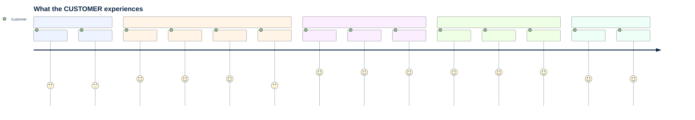

The section labelled **"Waiting - WE CHANGE THIS"** is the entire product. Everything
before it is what every call centre already does; everything after it is better *because* of
what happened during the wait.

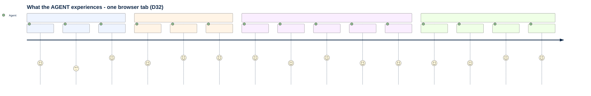

Note the ordering in "A call arrives": the agent **reads who and why before accepting**. The
brief is not something they open once the call connects — it is what they use to decide to
take it. That is only possible because context assembly starts at arrival, not at answer.

---

## 2.4 Before the phone connects

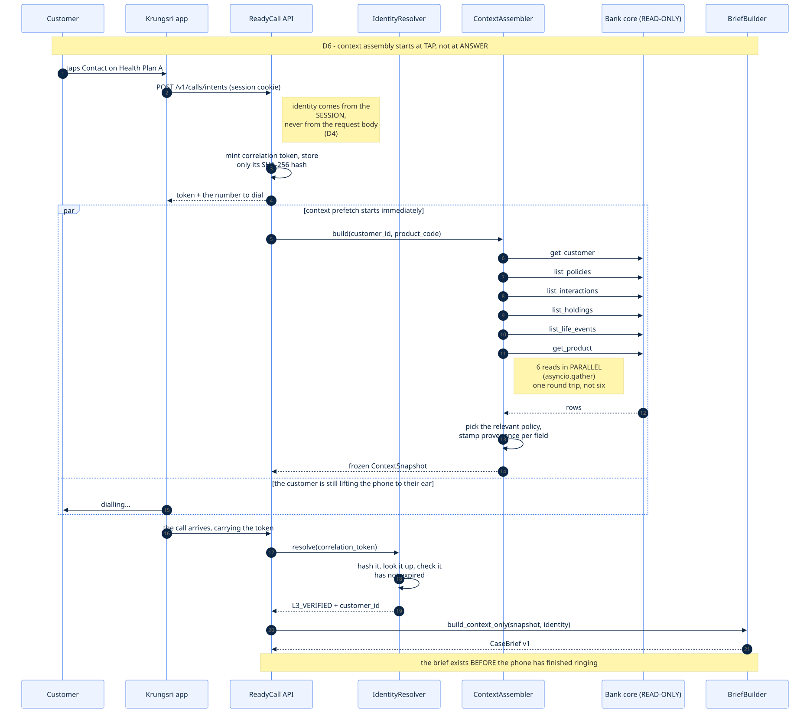

The `par` block is the point. The moment we know who is calling, six reads to the bank core
go out **in parallel** — customer, policies, interactions, holdings, life events, product.
One round trip's worth of latency instead of six, and all of it spent while the customer is
still lifting the phone to their ear.

Also notice where identity comes from: the **session**, never the request body (`D4`). The
app says "this person tapped Contact"; it does not get to say *who* they are. The server
already knows that from the login, and it mints a token bound to the customer id server-side.
We store only the SHA-256 hash — the token is a bearer credential, so it never rests in the
clear.

By the last line of this diagram the brief exists, and the phone has not finished ringing.

---

## 2.5 The IVR, the menu, and consent

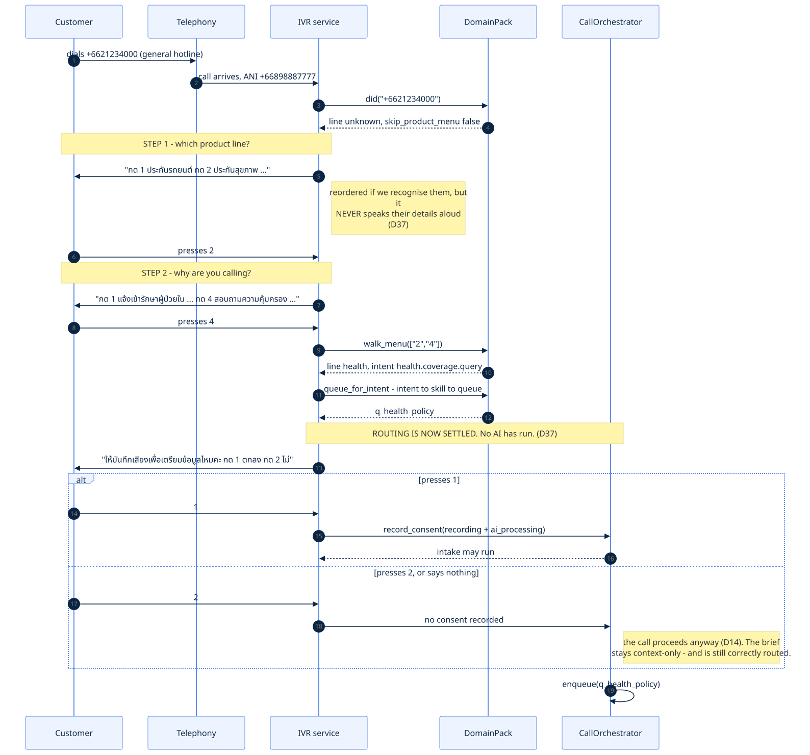

The line to hold onto is the note in the middle: **"ROUTING IS NOW SETTLED. No AI has run."**

Two keypresses give a product line and an intent, deterministically, from a lookup table. The
queue is chosen. Everything the AI does afterwards is enrichment. Why that matters enough to
be a whole design decision is in [Routing](04_routing.md#41-why-the-menu-runs-first).

The consent branch matters just as much. If the caller presses 2, or says nothing at all:
no recording, no transcript, no AI — **and the call proceeds normally**. Consent gates the
intake, never the call (`D14`). Health data is its own separate scope, because bundling it
into one yes/no would mean a motor-claim caller consenting to health processing to report a
dent.

---

## 2.6 The handover

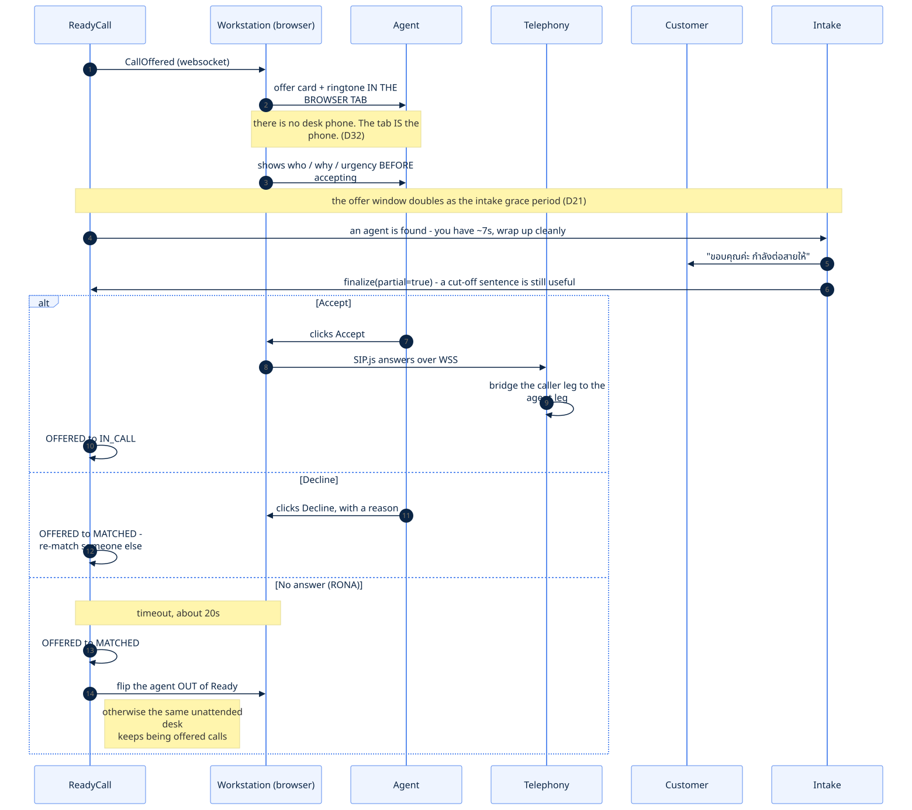

The offer card and ringtone happen **in the browser tab** — there is no desk phone to ring.

The clever part is the middle block. When an agent is found while the customer is still
talking, we have a genuine dilemma: cut them off mid-sentence, or make the agent wait?


`D21` resolves it by noticing the grace period was already there. The seven seconds an agent
spends reading the brief before pressing Accept are seconds the customer can still be
talking. Intake finalises as **partial** — a cut-off sentence is still useful evidence — and
nobody waits longer than they would have. We did not add time; we gave existing dead time a
job.

---

## 2.7 The live call

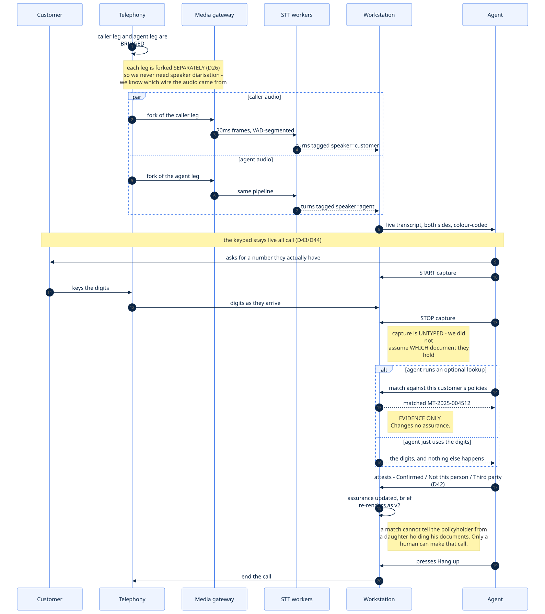

Two things worth knowing.

**Each leg is forked separately** (`D26`), so we never need speaker diarisation. Knowing
which wire the audio arrived on tells us who spoke — a hard ML problem replaced by a
plumbing decision.

**The keypad stays live** (`D43`, `D44`). Rather than asking the customer to read a number
aloud over a mobile connection — the single worst case for accuracy — the agent has them
*type* it.

Two things the diagram is careful about, both from `D44`:

- **The capture is untyped.** The agent does not ask for "your policy number" and build the
  feature around that; they ask for whatever number the caller actually has, and raw digits
  land on screen. We cannot assume anyone is holding a particular document.
- **A match never promotes assurance on its own.** An optional lookup renders *matched / not
  matched* as evidence, and the agent still attests. A daughter holding her father's documents
  can type his policy number perfectly — auto-promoting would file her as the verified
  policyholder.

More in [Identity](03_identity.md#33-the-keypad-is-a-tool-not-an-oracle).

---

## 2.8 Wrap-up

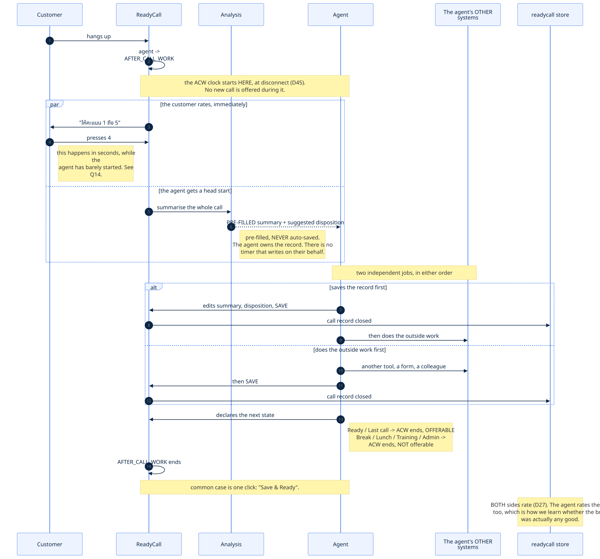

After-call work is **a real state**, not a gap between calls (`D33`). During it the agent is
not offered anything new. Pretending ACW does not exist is how contact-centre software
produces agents who are permanently "available" and permanently behind.

The summary is **pre-filled, never auto-saved**. The agent edits and owns the record — an AI
that silently writes the customer file is a liability, an AI that saves the agent ninety
seconds of typing is a feature.

**Saving the form and being done are two different things** (`D45`). Saving closes the call
record — that is *our* system's work finishing. But an agent's remaining work usually lives
somewhere we do not own: another internal tool, a paper form, a colleague to ask. After-call
work runs from the moment the media disconnects until the agent **declares what they are doing
next** — Ready, Break, Lunch, Training or Admin, any of which ends it. And nothing here is ever
auto-saved on the agent's behalf. See
[Agents](06_agents_and_matching.md#64-when-after-call-work-actually-ends).

Both sides rate the call (`D27`). The agent rating is the part people skip, and it is how we
find out whether the brief was actually any good — without it we would be optimising a
product with no feedback signal on its core claim.

---

## 2.9 Where the time goes

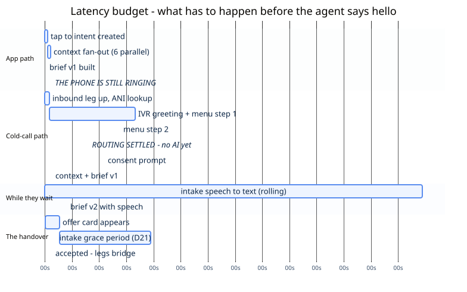

The app path gets to a built brief in well under a second, because it is all parallel and
starts at *tap*. The cold-call path is dominated by the human-speed parts — the greeting and
two menu steps — which is fine, because the customer is doing something during them.

The number that matters is the milestone in the middle of the cold-call row: **routing is
settled before any AI has run.** Everything after that is enrichment on top of a call that is
already correctly queued.

---

← [Start here](01_start_here.md) · [index](README.md) · next → [Identity & disclosure](03_identity.md)
