# 3. Identity & disclosure

_Who is calling, how sure we are, and what that permits._

← [The call](02_the_call.md) · [index](README.md) · next → [Routing](04_routing.md)

---

## 3.1 Identity is a ladder, not a yes/no

The temptation is to store `customer_id` and treat the call as identified. That is wrong,
and the reason is mundane: **a phone can be borrowed, shared, recycled, or spoofed.**

Thailand makes the recycled case especially real — prepaid numbers churn constantly, so a
number sitting in the bank's records may now belong to a stranger. If matching an ANI to a
customer unlocked their policy details, the system would happily read someone's coverage to
whoever inherited their old SIM.

So the resolver returns a customer id **plus an assurance level**, and the level is what
gates disclosure:

| Level | Reached by | The agent sees |
|---|---|---|
| **L0** | nothing matched | nothing — and that is a normal path, not an error |
| **L1** | caller ID matched a customer | the name, and *no policy number, no figures* |
| **L2** | caller ID **and** a pending app intent from minutes ago | policy details unlocked |
| **L3** | app token, or a verified challenge | everything |

The critical property: **the resolver never refuses.** An unknown caller is L0 and the call
continues. An expired token earns nothing and falls through to a weaker rung rather than
failing. Identity gates *disclosure*, never *the call itself* — refusing to connect someone
because we cannot identify them would be a worse product than the one they have today.

L2 is the interesting rung. On its own, caller ID is a guess. But caller ID *plus* "this
person tapped Contact in the authenticated app four minutes ago" is a much better guess —
two independent signals agreeing.

---

## 3.2 The ladder goes up during the call

Originally the ladder was decided once, at arrival — which was a real gap, because identity
is exactly the thing that gets resolved *during a conversation*. An ANI-matched caller stayed
at L1 forever and the agent could never unlock details they had just verbally verified.
`D42` adds the upward staircase.

**Three outcomes, not two.** The obvious design is Confirm / Deny. It is wrong, and the
failure is specific: a daughter calls about her father's claim. Under a binary, the agent
presses **Confirmed** — it *is* the right customer's case, after all — and the audit log now
records that the policyholder was verified. That is false, and it is precisely the record
PDPA requires. The binary quietly manufactures a compliance lie. So there is a third option:
*third party acting for them* — the case context is visible, disclosure stays locked, and a
playbook step appears to check authority to act.

**Rejection is not plain L0.** "This is *not* C000002" is information. It stops the system
re-proposing them, and it feeds a data-quality signal — a rejected ANI match usually means a
stale number in the core data. A contact centre that logs these hands the bank a free
data-hygiene feed.

**Never ask a leading question.** The agent asks *"ขอทราบชื่อผู้ติดต่อด้วยค่ะ"* — may I have
your name — not *"is this Khun Pattheera?"*. Two reasons, and the second is the better one:
naming the customer first confirms to whoever holds that phone that the number belongs to
them; and a leading question is *weaker verification*, because anyone can answer "yes" while
a name has to be produced.

---

## 3.3 The keypad is also a verifier

Spoken digit strings are the worst case for accuracy anywhere in this system — short,
phonetically confusable, and with no linguistic context for a human or a model to lean on.
Every *"ขอโทษค่ะ ทวนอีกครั้งได้ไหมคะ"* is dead air, the exact thing this product exists to
remove.

So `D43` keeps DTMF capture live for the whole call. The agent clicks "policy number", a
field appears, and the customer types it.

The part that makes this more than a data-entry convenience: **when we already hold their
data, the typed value can be checked against their actual policies.** A match is
machine-verifiable evidence — strictly stronger than an agent's judgment of a spoken answer
— so it promotes assurance automatically, with an audit line like `matched MT-2025-004512 at
14:32:07`. No subjective confirmation involved.

This is the same principle as the keypad menu, applied twice: **the keypad is the reliable
channel and the microphone is the lossy one, so give the keypad the jobs speech is worst at.**
Neither use needs AI, so neither can degrade when the AI does.

Two hard constraints:

- **Never capture a full secret.** Last 4 of a citizen ID, never the whole number; never a
  card number. For secret-ish challenges the system stores **the outcome only** — matched or
  not — never the digits. A policy number is not a secret and is stored.
- **P5 gotcha:** the caller's channel must stay in the Stasis app and be bridged from within
  it, or Asterisk stops emitting `ChannelDtmfReceived` once the legs bridge.

---

## 3.4 Consent, per scope

PDPA is a judged criterion in this competition, not a nice-to-have, and the design takes two
positions on it.

**Scopes are separate.** Recording, AI processing, health data and cross-org sharing are
consented individually. The easy build is one yes/no; it is the wrong one, because health
information is a special category and a motor-claim caller should not have to consent to
health processing to report a dent.

**Declining costs the caller nothing.** No consent means no intake — and the call proceeds,
correctly routed, because the keypad menu did the routing. The brief is thinner, and the
workstation says *why* it is thinner. Compare that to a design where the AI does the routing:
there, declining consent would degrade the actual service, which turns "consent" into
coercion.

Retention and erasure land at P7. The design constraint they impose now: blob references are
indirect rather than inlined everywhere, because an erasure request has to reach the
recording, the transcript, every brief version *and* the event log.

---

← [The call](02_the_call.md) · [index](README.md) · next → [Routing](04_routing.md)
