# 4. Routing

_How a caller reaches the right specialist — and why a keypad beats a language model at it._

← [Identity & disclosure](03_identity.md) · [index](README.md) · next → [Context & the brief](05_context_and_brief.md)

---

## 4.1 Why the menu runs first

This is the single most important product decision in the project (`D37`), and it came from
a good question: *what does the system know in the worst case?*

The original design had AI doing the routing — transcribe what the caller says, classify the
intent, pick a queue. It demos beautifully. But trace the failure path: the caller declines
recording, or the STT worker is down, or the model is wrong, or they simply say nothing. Now
we know **nothing at all** and dump them in a general pool. That is *worse than the call
centre they already have* — which at least asks them to press 1 for motor.

Inverting it fixes the floor. The keypad menu runs first, deterministically, from a lookup
table. Two keypresses give a product line and an intent. The queue is settled before a single
word is transcribed.

That reframes what the AI is for. It is no longer load-bearing infrastructure that everything
depends on — it is **the delta on top of a parity base**. It adds the detail a keypad can
never capture: which hospital, which plate number, how urgent, what they actually need. If
every AI component fails simultaneously, the call still reaches the right specialist.

There is also a demo argument. "Our AI routes calls" invites the judges to ask what happens
when it is wrong. "Our floor is exactly what you have today, and everything above it is
upside" is a much harder position to attack.

---

> **Built as of P3.** What the caller actually *hears* walking this tree — the composed
> menu, the personalised ordering, and every path that does not end in a route — is
> **[The line](12_the_menu.md)**.

## 4.2 The menu tree

**Generated from `config/menus.yaml`** — this is what the system will actually do, not a
sketch of it.

Two steps, deliberately. One flat menu of twenty-eight options would be unusable; two steps
of five to seven each is what people are already used to. Every line ends with
*เรื่องอื่นๆ* — a catch-all — because a caller whose reason is not on our list is still a
caller, and they should keep their product context rather than dropping to a generic unknown.

**On personalisation:** when we recognise the caller, their likely options are promoted to
the front and given the low numbers. But the spoken line is *always* just the number and the
plain label — **"กด 1 ประกันรถยนต์"**. It never speaks their details. Reading someone's own
plate or policy number back at them through an IVR is unsettling, and it makes every option
take longer to hear, which is the opposite of the point. Reordering only.

The menu is **skipped entirely** when we already know the answer — an app tap knows the plan,
a product DID knows the line. Asking a question you already know the answer to is bad
service.

---

## 4.3 Intent → skill → queue

**Generated from `intents.yaml` and `skills.yaml`.** Large — that is the point; it is the
whole routing table at a glance.

The chain is deliberately indirect: an **intent** maps to a **skill**, and a skill maps to a
**queue**. Why not intent straight to queue? Because skills are what agents actually have.
Merging two queues, or splitting one, then becomes a config edit rather than a re-mapping of
twenty-eight intents.

Dotted lines are **overflow** — where a queue sends calls when it cannot serve them.

This chain also fails loudly rather than silently. `DomainPack.load()` cross-validates the
whole thing at startup: an intent pointing at a skill that does not exist, a queue that
overflows into a cycle, a product line with no catch-all — each raises `ConfigError` with a
specific message. The alternative is a caller silently vanishing into a queue nobody staffs.

**The fallback chain** (`D40`) matters when the intent is unknown: explicit intent → **the
line's catch-all** → the DID's default queue → general. Knowing the product line but routing
to the general queue throws away information we had, which is exactly the bug this fixed.

---

## 4.4 The published numbers

**Generated from `config/dids.yaml`.**

A published number is an **optimisation, never a dependency**. `skip_product_menu: true` just
means "we already know this one, do not make them press a key". Everything works with no DID
entries at all — it simply asks one more question.

Two real-world cases, both handled: one general hotline for everything (the common case in
Thailand today), or a number per product line (then the number *is* the answer to menu step
one).

The motor claims number carries `urgency_floor: high` — someone dialling the number printed
on the documents in their glovebox is very likely standing next to a damaged car, so urgency
is raised before anyone has said a word.

---

## 4.5 Insurance is not just health

**Generated from the `ProductLine` enum and the intent taxonomy.**

Worth stating because it is easy to build the whole thing around the pitch's health scenario
and then discover motor does not fit. Motor, health, life, travel, personal accident and
savings are all first-class, each with its own reason menu, its own skills, and its own
catch-all.

The intent taxonomy and the Thai wording throughout these files are a **straw man** — good
enough to build and demo against, and explicitly flagged for review with real domain
knowledge during the hackathon. What matters structurally is that changing them is a YAML
edit, not a code change.

---

← [Identity & disclosure](03_identity.md) · [index](README.md) · next → [Context & the brief](05_context_and_brief.md)
