# 5. Context & the brief

_How the agent's screen fills in before the phone is answered — and what happens when it can't._

← [Routing](04_routing.md) · [index](README.md) · next → [Agents & matching](06_agents_and_matching.md)

---

## 5.1 Assembling everything we know

This is the piece that makes the pitch's central claim literally true: context assembly
starts at *tap*, not at *answer* (`D6`).

**Parallel, not sequential.** Six independent reads go out at once via `asyncio.gather`. Done
one after another they would blow the entire tap-to-snapshot budget on network round trips
for no reason.

**Nothing can sink it.** Every read is wrapped so one dead field produces a thinner snapshot
rather than an exception. An anonymous caller gets an *empty* snapshot rather than `None`,
which keeps every caller of this method free of special-casing.

**The interesting logic is choosing the relevant policy.** Most specific evidence first: the
exact plan they tapped, then the product line the DID or menu gave us, then — only if they
hold exactly one — that one. And then the case worth pointing at: **with two unrelated
policies and no signal, it deliberately returns nothing.** A confidently wrong policy on the
agent's screen is worse than an empty panel, because the agent will act on it. Refusing to
guess is a feature.

**Provenance per field.** Every field records where it came from, which adapter produced it,
when it was fetched, and whether it is stale. If the workstation cannot answer *"says who,
and how old is this?"*, the agent has no way to judge what they are looking at (`D18`).

**Frozen at the end.** The snapshot is immutable, so the screen shows what the system knew
*when it decided*, and a replay reproduces the same brief even if the underlying data has
since moved.

---

## 5.2 What the agent is allowed to see

Look at the top-left box: the frozen snapshot **holds everything** — full policy numbers,
every coverage figure — regardless of assurance. The gate is on *rendering*, not fetching.

This was verified rather than assumed. At L1 in the motor scenario, the snapshot contains
`MT-2025-004512` and all four coverage figures, while the brief prints *"มีกรมธรรม์ที่
เกี่ยวข้อง (ยังไม่ยืนยันตัวตน)"*.

The consequence is the good kind: **confirming identity is a re-render, not a re-fetch.** No
round trip to the bank core, no spinner. The data was already in memory.

Below L2, three things happen automatically:

1. the policy number is replaced with a neutral phrase,
2. a verify-identity step is **prepended as action 0**,
3. every playbook step tagged L2-required is **dropped**.

The agent is never blocked — they are told what to do first.

**Two rules this diagram encodes:**

- **Gate at the wire, server-side.** The workstation receives only what the current level
  permits. Sending the full brief and hiding fields in React would put someone's coverage one
  devtools panel away.
- **The LLM is not even imported in this module** (`D16`). Every figure is read from a typed
  `Coverage` field. There is no code path that could put an invented number on an insurance
  screen — and a hallucinated room-and-board limit is not a bad answer, it is a mis-selling
  incident.

Promotion produces brief **v2**; briefs are versioned and never mutated (`D7`), so the record
shows what the agent saw before and after.

### Where the recommended actions come from

Worth spelling out, since it is invisible in the diagram. The chain is:
`intents.yaml` gives each intent a **playbook** name → the playbook maps to an ordered list
of `(Thai text, required assurance)` steps → the list is filtered against the caller's level
→ if below L2, the verify step is inserted at position 0.

Hand-written, static, deterministic, no AI. That is why it is the version that must never
fail. The steps move out to `config/playbooks/` at P4 — and even then the rule holds: **the
model may rank and select from the playbook; it may never write a step.** An invented
instruction in an insurance call is a compliance incident, not a bad suggestion.

---

## 5.3 When the bank's data is slow or down

The circuit breaker matters more than it looks. Without one, a dead core costs a **full
timeout per lookup** — six parallel reads means the slowest timeout, on every single call,
for every caller, for as long as the outage lasts. Briefs arrive late exactly when the system
is already struggling.

With it, the second call onward fails in microseconds and serves whatever the cache holds.
Degradation becomes cheap.

The `served_stale` flag propagates all the way to the agent's screen as `CORE_DATA_STALE`.
An agent looking at data from four minutes ago deserves to know it is from four minutes ago.

---

## 5.4 The degradation ladder

**Generated from the `DegradationReason` enum**, so it lists every reason the system can
actually record.

The shape is the argument. Every failure path — no consent, declined intake, STT down, LLM
down, core data unreachable, stale cache, low assurance, media fork failed, timed out —
lands on a *lesser brief*, and every lesser brief still lands on **the call connects
anyway**.

That is `D12` drawn out. The AI is never in the path of the human connection. The worst case
is a thin brief, never a delayed or failed call.

And the context-only brief — the middle box — is the one that must never fail, which is
exactly why it was built first at P1 and why it depends on no AI at all.

---

← [Routing](04_routing.md) · [index](README.md) · next → [Agents & matching](06_agents_and_matching.md)
