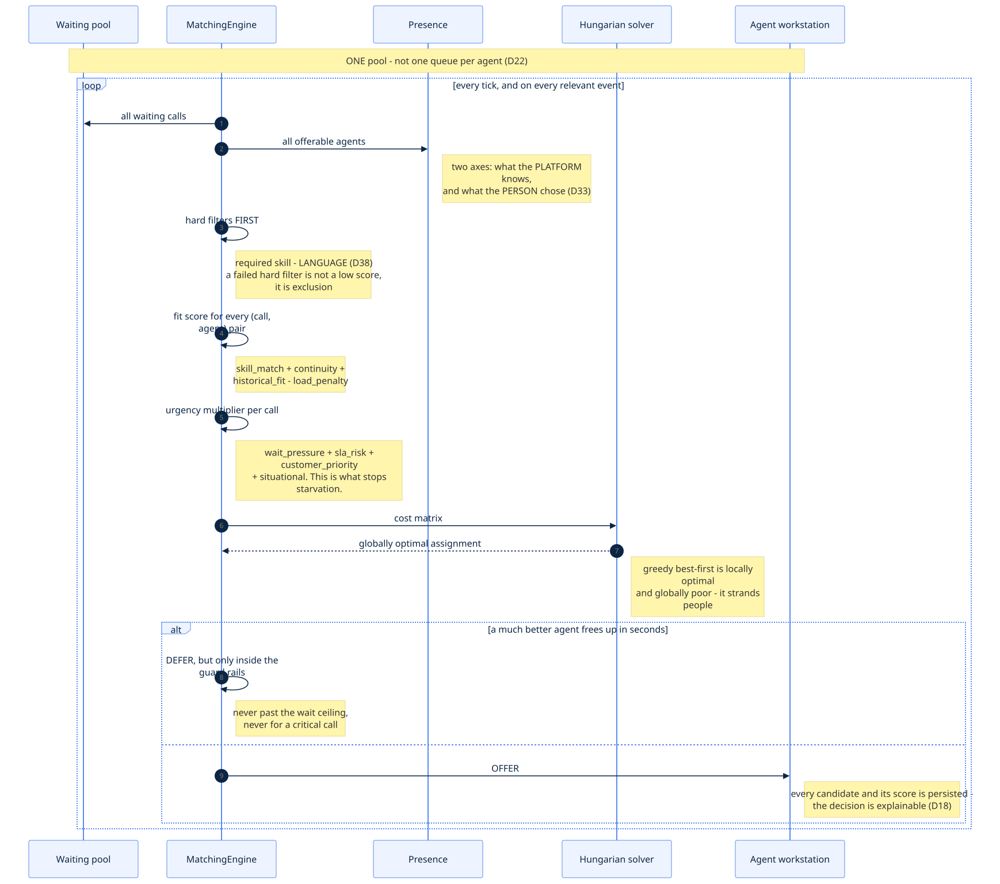

# 6. Agents & matching

_Who gets which call, why, and the one browser tab they work in._

← [Context & the brief](05_context_and_brief.md) · [index](README.md) · next → [Voice & AI](07_voice_and_ai.md)

---

## 6.1 The matching loop

**One waiting pool, not one queue per agent** (`D22`). Per-agent queues look tidy and behave
badly — a caller stuck behind one busy agent waits while three qualified people sit idle.

The loop runs on a tick *and* on relevant events, so an agent becoming free triggers a match
immediately rather than up to a tick later.

---

## 6.2 How a pairing is scored

Three stages, and the order matters.

**Hard filters first.** Does the agent have the required skill? Can they speak a language
this caller accepts? **Can they take a call at all right now?** A failed hard filter is
*not a low score* — it is exclusion. Scoring these as soft preferences is how you end up
routing a caller to someone who cannot help them, just because everything else scored well.

⚠️ **That third question was not asked until `B25`** (2026-09-05), and its absence is worth
knowing about because nothing looked wrong: `AgentPresence.is_available()` existed, said
exactly this, and was called by nothing. A caller was offered to an agent whose own screen
said *ยังไม่พร้อม*, and an agent who had signed out kept collecting callers and holding each
for the full RONA timeout. The filters now split into **capability** (`skill`, `language`)
and **availability** (`offline`, `not_ready`, `busy`, `at_capacity`), and which group fails
is what decides the caller's unplaced reason — see `D108`, which is why there are four of
those rather than two.

**Fit** answers "how good is this agent *for this call*": skill match and proficiency,
continuity (did they handle this customer before?), historical performance on this intent,
minus a penalty for current load.

**Urgency** answers a different question — "how badly does *this call* need someone": how
long they have waited, SLA risk, customer priority, and situational urgency like being at a
crash scene.

**Urgency multiplies rather than adds**, and that is the design's answer to starvation. Under
pure best-fit, a caller nobody is a great match for waits forever while better-matched
callers overtake them. Multiplying means waiting eventually wins on its own: `wait_pressure`
climbs toward the urgency ceiling and, inside one queue, the longest waiter takes the agent.

**Past `MAX_WAIT_BEFORE_ANY_AGENT_S` there is a second, absolute layer** (`D93`): a pre-pass
runs *before* the solver and hands every past-ceiling caller a qualified free agent, longest
wait first. It takes the **lowest**-fit qualified agent on purpose — `require_skill` already
guarantees they can help, so giving away the specialist would just move the starvation onto
whoever needed them.

Two bugs lived here until 2026-09-01, and both were invisible within a single queue. `B12`:
`waiting_s` was frozen at admit time, so `wait_pressure` never rose and every threshold was
unreachable. `B13`: the ceiling sat inside `_guard`, which only runs for a call the solver
**already chose** — so it could never fire for a caller who lost the matrix, which is the
only caller it was for.

**Global, not greedy.** Greedy best-first is locally optimal and globally poor — it hands the
one bilingual agent to the first caller who asks, then strands the caller who genuinely
needed them. The Hungarian algorithm optimises the whole matrix at once.

**Every candidate is persisted** with its sub-scores, the weights version, and the solver
used (`D18`). "Why did I get this call?" has to be answerable — a matching decision nobody
can explain is one nobody will trust enough to leave switched on.

---

## 6.3 An agent has two states at once

**Generated from the enums.** The insight is that "agent status" is really two independent
things, and conflating them causes bugs:

- **`system_state`** is what the *platform* knows: offline, available, being offered a call,
  on a call, in after-call work. The agent does not set this; it follows from what is
  happening.
- **`agent_intent`** is what the *person* chose: ready, break, lunch, training, admin, last
  call, draining.

Offerable means **both** — `AVAILABLE` *and* an intent of ready or last-call. Keeping them
separate is what lets "I want to stop after this call" (`LAST_CALL`) work cleanly: the person's
intent changes immediately while the platform state follows the actual call.

`AFTER_CALL_WORK` being a real state is `D33`. And RONA flips the agent out of ready —
otherwise the same unattended desk keeps being offered calls forever.

---

## 6.4 When after-call work actually ends

The original design ended after-call work when the agent pressed **Done** on the wrap-up form.
That quietly assumed all of an agent's post-call work happens *inside this system*. It does
not — there is another internal tool, a paper form, a note to write, a colleague to ask.

`D45` separates the two statements that were being conflated:

- **Saving the wrap-up form closes the call record.** Our system's work is finished.
- **The agent declaring their next state ends after-call work.** Their work is finished.

So `AFTER_CALL_WORK` is measured **from the moment the media disconnects** until the agent
says what they are doing next — not from any form action, and not "the time taken to fill in
our form".

**Any declared state ends it, not just Ready.** An agent who saves the record and goes to
lunch has finished their after-call work; they are simply not available. Ending ACW only on
*Ready* would show them sitting in after-call work for an hour — false, and useless as a
metric. Ready and Last-call end ACW *and* make them offerable; Break, Lunch, Training and
Admin end ACW and leave them un-offerable.

**Saving and declaring are independent, in either order.** An agent may finish their outside
work first and then press *Save & Ready* in one go, or save the record immediately and declare
later. Both are normal.

**There is no auto-save.** An earlier version of this decision had a timer save the record
"so a call cannot hang open forever". That was wrong three times over: it contradicted
`D33`'s own *pre-filled, never auto-saved* rule; nothing is actually held open once the
customer has hung up — no media, no channel, just a row in our own database that nobody is
waiting on; and an unsaved wrap-up is **honest data**, recording that this call was never
wrapped up. Auto-saving replaces a true fact with a fabricated one. Any timer here is purely a
visibility device — a long-ACW indicator for the agent and their supervisor. It writes
nothing.

**Why auto-ready is actively worse, not just inaccurate:** marking an agent available while
they are mid-task somewhere else means the next caller rings an empty desk for a full offer
timeout and is then re-matched. That is RONA, and it is customer-visible. A slightly worse
utilisation number is far cheaper than a caller waiting through a ring cycle for nobody.

Two things worth noticing:

**The data model already supported this.** `AgentPresence.is_available` has always required
`system_state is AVAILABLE` *and* `agent_intent is READY`. The bug was never the model — it
was letting a form submission drive the platform's axis. The fix touches agent presence only;
`CallState` is untouched, because the call's own lifecycle was always independent of whether
the agent is ready for the next one.

**It makes the headline metric true.** Shrinking ACW is one of this product's most credible
claims, since the AI drafts the wrap-up. Measuring only time-in-our-form would let us shrink
the number without shrinking the agent's actual work. End-of-call to declared-ready measures
the real thing — including the systems we do not own, which is what workforce planning wants
to know anyway.

And it stays one click in the common case: the workstation offers **Save & Ready** together.
They only separate when the agent needs them to.

---

## 6.5 The workstation

The correction that produced this design: the agent screen is **not an info display next to a
phone**. It is the contact centre. Calls are taken, made and spoken through the browser tab
itself, with the headset plugged into the PC (`D32`).

That has real consequences — the softphone is SIP.js over WSS with WebRTC audio, so the
workstation needs device selection, a self-test, and reconnect handling. It also removes an
entire class of demo risk: no desk phones to configure, no second device, nothing to install.

The three panels answer the three questions an agent has: **who is this, why are they
calling, and what should I say?** The evidence column is the trust layer — provenance, the
live transcript, and the gated policy panel.

The visible stage timeline ("context ready at 0.4s, before the phone rang") is `D18` paying
off on stage. If the system cannot explain why it did something, it is not finished.

---

← [Context & the brief](05_context_and_brief.md) · [index](README.md) · next → [Voice & AI](07_voice_and_ai.md)
