# 7. Voice & AI

_Speech in, meaning out — and the seam that turns intake into a full AI caller later._

← [Agents & matching](06_agents_and_matching.md) · [index](README.md) · next → [Data & events](08_data_and_events.md)

---

## 7.1 Thai speech to text

**Thonburian Whisper** (`biodatlab/whisper-th-medium-combined`) is the default — a Thai
fine-tune of Whisper that materially outperforms the base model on Thai.

The shape of the pipeline matters as much as the model:

- **VAD endpointing, not fixed chunks.** Cutting audio every N seconds slices words in half.
  Detecting where an utterance actually ends produces clean segments and better text.
- **Inference in a worker process, never the event loop.** Model inference is CPU/GPU-bound
  and would block every other call on the box.
- **Streaming-first, re-implemented** (`D9`). There is a working Thonburian implementation in
  an earlier project of ours, but it is *file-based* — record, then transcribe. This system
  needs partial results while the customer is still talking. Different shape entirely, so it
  is reference for how the model behaves, not code to copy.

**The GPU constraint is real.** An RTX 3050 laptop, 4–6GB. Whisper pads every chunk to 30
seconds regardless of actual length, which is why segmentation matters so much, and why
`faster-whisper`/CTranslate2 with `int8_float16` is probably *required* rather than optional
to hit the latency budget. Do not plan to run a local LLM and Whisper on the same card — the
default split is STT local, LLM via API.

Typhoon ASR and cloud STT are benchmarked against it on the same audio (`D30`), because "which
Thai model is better" is a measurable question and should not be settled by preference.

---

## 7.2 The LLM layer

**Two adapters implemented from day one** (`D29`): Anthropic, and one OpenAI-compatible
adapter that covers Typhoon's API, OpenAI, vLLM and Ollama by base URL alone. Building both
immediately is what makes "which model is better at Thai insurance jargon" answerable on a
golden set rather than by argument.

**No LLM framework** (`D31`), and this is a deliberate, documented choice. What the system
actually needs is: render a versioned prompt, call an HTTP endpoint, parse JSON into a
pydantic model, retry sensibly, and record cost and latency. That is a couple of hundred
lines we fully control. A framework would hide the prompt, hide the retry logic, add a
dependency that breaks on upgrade, and make the one thing we care about most — *exactly what
text went to the model* — harder to see.

The decision has an explicit revisit trigger written into it: if we ever need genuine
multi-step tool use, reopen it. A decision with no reversal condition is dogma.

**The hard rule above everything else** (`D16`): coverage figures, eligibility and prices are
**data**. The model may summarise, classify, and rank. It may never *produce a number*.
Hallucinating a room-and-board limit in an insurance context is a mis-selling incident, not a
bad answer — so the brief builder does not even import the LLM.

---

## 7.3 The intake seam

This exists because of an explicit requirement: pre-call intake must be modular enough to
*become* a full AI caller later — one that talks with the customer while they wait — without
rewriting everything around it.

`D10` makes intake a **swappable strategy** behind one output contract:

- **Passive** (**built**, P3 step 4a): "กรุณาเล่าเรื่องที่ต้องการติดต่อ..." — the customer
  talks, we listen and transcribe. No AI in the loop with the customer at all.
- **Guided** (P8): TTS asks for the specific missing slots — which hospital, what date.
- **Conversational** (P8): a real back-and-forth AI caller.

All three produce the **same `IntakeResult`**: turns, slots, a recording reference, a
finalize reason, and whether it was partial. Nothing downstream — the brief, matching, the
workstation, storage — can tell which one ran.

Getting that output contract right *now*, while the simplest strategy is the only one built,
is what makes the ambitious version a swap later instead of a rebuild. The seam is cheap
today and very expensive to retrofit.

**A strategy is handed turns, not audio** (`D88`). `ARCHITECTURE.md` first drew
`start(session, media)`, which would have put the media gateway, the resampler, the VAD and
the STT worker on the *strategy's* side of the seam — four things that are really one
concern, turning audio into sentences. Moving them across made a strategy a pure function of
what was **said**, which is why `PassiveRecordIntake` could be written, implemented and
tested three phases before the GPU it will eventually run beside. What it still lacks is
anything feeding it: `IntakeService.on_turn` is called by tests and scenarios only.

The prompts themselves are pre-rendered TTS clips built from a YAML file of Thai text
(`D24`), not recorded audio and not live synthesis — so changing wording is editing a line
and re-running a build step, with no studio and no per-call latency.

---

← [Agents & matching](06_agents_and_matching.md) · [index](README.md) · next → [Data & events](08_data_and_events.md)

## 7.x The audio path — from a phone line to `on_turn`

Built at P3 step 4b (`D96`). Five things in this picture are decisions rather than plumbing.

**Normalisation happens once, at the edge.** `ports/stt.py` promises everything above it
16 kHz mono float32 *always*, and `media/audio.py` is the only module in the system allowed
to know that a phone call is not already that. It handles **both G.711 companding laws** —
µ-law for North America and Japan, **A-law for Thailand** — because decoding one as the
other does not raise. It produces loud, distorted, entirely plausible audio, and the first
thing anybody would blame is the microphone or the model.

**It is pure Python with no numpy, deliberately.** CI runs `uv sync --frozen` with no
extras. If the audio path needed torch it would only ever execute on the one laptop with a
GPU — `B7`'s shape exactly. The same argument is why `EnergyVad` exists alongside Silero.

**The endpointer has no model, no I/O and no clock**, which is what makes `D9`'s inherited
constants assertable against a plain list of floats. The 120 ms *leading* pad is the most
load-bearing number in it: Whisper clips the first syllable without it, and in Thai that
syllable frequently carries the tone that distinguishes the word.

**Ingestion never waits for the model.** One queue, one consumer, one sequence counter — so
frames keep arriving while Whisper works, and turns stay in order without a sorting step. A
task per segment would transcribe a two-word phrase faster than the sentence before it and
deliver the caller's words shuffled.

**The three guards after the model are not tidiness, and each one exists because of
something measured.** They are three *different kinds* of check on purpose — a failure that
dodges one rarely dodges all three.

| Guard | Asks | Came from |
|---|---|---|
| level gate | is there any energy here at all? | `B14`: 1 s of digital silence cost **8578 ms** against **155 ms** for real speech |
| repetition | is one chunk repeated until it buries the sentence? | `B16`: the first version split on whitespace and caught **0 of 3** real Thonburian loops, because **Thai has no spaces** |
| vocabulary echo | is this mostly our own hint handed back? | `B14`: fed silence with the hint, the model returned three of our own terms in our file's order |
| speech rate | could a human have said this much in that long? | `D98`: **measured** on 61 annotated real Thai segments — median 7.6 chars/s, max 15.0; the real loops are 39-53 |

**The original two, and why they were not enough — `B14`.** Measured on this GPU:
one second of digital silence costs **8.6 seconds** and comes back with invented Thai — so a
VAD false positive is a latency bomb, not just a junk turn. And fed a non-speech segment
with our own vocabulary hint, the model returned three of `config/stt_vocabulary.yaml`'s
terms, in that file's order, as if the caller had said them. That is worse than an ordinary
hallucination: the invented words are exactly the domain terms that make a brief look
credible, and the agent cannot tell. It is `D16`'s hazard one layer below where `D16` guards
it.

**The dataset changed what can be measured.** 22 GB of real Thai call-centre audio now
sits outside the repo (`D97`), and its scripts carry per-segment timestamps *including
explicit `noise` spans* — ground truth for **where nobody is speaking**, which is exactly
what the endpointer decides and the one thing an accuracy score cannot tell us.
`scripts/score_endpointer.py` consumes `segments.tsv` and reports **coverage 0.782, span
recall 0.885** on the balanced set — and the seconds it "misses" are 86% near-silent and
72% within half a second of an annotated boundary, i.e. an annotator rounding outward.
`D9`'s inherited constants are right for this audio; leave them.

**The engine is settled** (`D30` closed by `D104`). Paced, 20 real calls, against
`ARCHITECTURE` §15's p95 < 1.5 s:

| | Thonburian fp16 | CT2 int8 + hint | **Typhoon** |
|---|---|---|---|
| p95 median / worst | 19.5 s / 58.7 s | 1.68 s / 2.53 s | **0.19 s / 0.28 s** |
| inside the budget | 0 of 12 | 7 of 20 | **20 of 20** |
| CER mean | **0.109** | 0.128 | 0.133 |
| VRAM | 2716 MB | ~1000 MB | 1068 MB |

**Typhoon ships; CT2 is the fallback for a box where NeMo will not install.** The reason is
structural and was predicted in `D99` before it was measured: a transducer has **no 30 s
window**, so it does not pay a full encode for a two-second utterance the way every Whisper
variant does. It also returns **empty in 149 ms** on silence where Whisper spends **8578 ms
inventing Thai** (`B14`).

The trade, stated rather than buried: Typhoon is ~22% relatively worse than fp16 on CER,
**cannot use the vocabulary hint at all**, and is measurably weaker on spoken digits
(digit-heavy calls 0.132 vs CT2's 0.099, while beating it on conversation 0.137 vs 0.171).
Mitigated by architecture rather than by the model — `D44`'s keypad is how a policy number
actually arrives.

⚠️ **Rank on the CER MEAN, never the median and never WER.** The median is unstable at 20
samples (two identical runs gave 0.087 then 0.124); whitespace WER on unsegmented Thai read
**0.94-1.12** on a model that was working perfectly (`B18`).

**What is still not in this picture:** the *live* call — `D26`'s agent leg is P6. The
bake-off table is finished (`D104`, above), the transcript reaches the agent's screen
(§7.y), and the recording reaches object storage encrypted (§7.z).

---

## 7.y From `on_turn` to the agent's screen

Everything in §7.x existed for days and **had never transcribed anything in the running
system.** Four pieces were missing, and two of them were invisible from either end — the
whole story is `B24`, and it is worth reading before adding a subscriber to anything.

**Nothing opened a recording.** `TranscriptionService.open()` was called by its own tests
and by nothing else in the repository. `run_offer` returned a `HoldReport` saying
`recording=True` into the void, so no leg opened, no frame was endpointed and **no
`transcript.turn` was ever published by a real call.** `D88` is why: a strategy takes turns,
not frames, so `IntakeService` deliberately does not know about media — which means somebody
*else* has to open the leg, and nobody was appointed. `D107` appoints the demo endpoint, and
P5's telephony adapter inherits the job.

**Nothing drained the bus.** `publish()` only enqueues; handlers run on `drain()`. That is
`D15` and it is what makes a scenario replay byte-identical. But the only `drain()` in the
live process was a background task on `POST /v1/calls/intents`, so a subscriber to
`transcript.turn` would have been **correct, tested, and unreached**. `D105` adds a pump —
its own driver at 0.05 s, not a line in the 1.0 s sweep, because this one is on a 1.5 s
budget the model already spends 0.19 s of.

**Nobody owns the call during intake, and that is the product.** The transcript is built
*while the caller waits*, so when a turn is published there is no `agent_id` to send it to.
The delivery service holds the call's turns and flushes them **on accept** — not on the
offer, because an offer can be declined and re-matched (`D52`) and an agent who declines
would have read the caller's words verbatim for a call they never took. `D69`'s gated
summary on the offer card is the precedent for waiting; it is not a licence to widen.

**Every push carries the whole transcript.** Not a delta. `D68`'s rule in the place it
matters most: a client that accumulates can drop one message and render a transcript with a
sentence missing from the *middle*, with nothing on screen to say so.

**And it is not gated on assurance**, which is a decision (`D106`). `D74` gates what an
agent may say and do; `D53`/`B5` gate the customer's *record*. This is the caller's own
speech on the call being taken — at any level, **L0 included**, which is precisely the
caller with no other source of context. Nothing in the panel was looked up, and that is the
line that matters.

### Two things this cost, recorded because they will recur

**The order at the accept is load-bearing.** `transcription.close()` must run **before**
`intake.on_agent_accepted()`. `finish()` transcribes the segment still open and drains the
queue, and those turns reach `on_turn` — which passes them on only while the strategy is
still running. Finalising first dropped every one: the last sentence the caller said as the
agent picked up, logged and gone. `D21` says the offer window *is* the grace period; the
order is what makes that true rather than merely intended.

**One engine per process is right for a model and wrong for a script.**
`ScriptedSttEngine` carries a cursor, so the first demo call consumed every line and the
second rendered an empty panel — the stage-safe fallback failing in exactly the way it
exists to prevent. Every test passed, because each placed one call. `open()` now resets an
engine that offers `reset()`, through a capability protocol like `BatchSttEngine`'s
(`D107`), and a test places **three** calls.

---

## 7.z The recording, and the key that protects it

The third clause of `ARCHITECTURE` §6 — *"writes the encrypted recording to object
storage"* — and the last thing P3 was missing (`D110`, 2026-09-06). Everything above this
section analyses audio and keeps none of it; this is the one place a caller's voice becomes
a durable object, and almost every decision in it is about that fact rather than about
audio.

**The recorder is a second subscriber, not part of the gateway.** The gateway already fans
normalised frames to whoever asked; the transcriber is one consumer and this is another.
Writing the object from inside would put a bucket, a key ring and a retention policy behind
the boundary that lets P5 swap Asterisk for Twilio. It also buys independence in the
direction that matters: a transcriber that is down still records, and a caller who refused
*analysis* is not thereby refused a recording — or the reverse.

That independence forced a change with a bug's shape behind it: **`open_leg` is now
idempotent**. Two consumers open a leg, and replacing it on the second call would have
silently discarded the first one's sinks — a component correct, running, subscribed, and
fed nothing. That is `B24` exactly, and it is why the fix has two tests that fail without
it rather than a comment saying it should be fine.

### Consent is checked at the seal, not at the open

The offer window **is** the recording window (`D21`), so a caller who presses `2` has had
frames flowing the whole time. Checking consent when the leg opens would be too early —
the keypress can land after it. So the audio accumulates in memory, is transcribed for the
brief, and at `close()` the session is asked whether `recording` was granted. If it was
not, the buffer is dropped and **nothing is written anywhere**.

That is the version of `D14` you can check rather than read: place two calls, one pressing
`1` and one pressing `2`, and count the objects in the bucket. There is one.

### The upload is not on the accept path

`close()` moves a list onto a queue and returns; `flush_pending()` uploads, from
`sweep_once`. An object-store round trip between an agent pressing Accept and the caller
hearing them is `D12`'s rule broken in a place it had not had to be applied before. A
failed upload keeps its place and retries on the next sweep, and **the `audio_recordings`
row is written only after the store confirms the object** — a reference to an object that
was never written is a recording that looks retrievable, satisfies an audit, and plays
nothing.

An abandoned caller never produces an Accept at all, so the service also listens for a
terminal state. Without that their buffer would sit open for the life of the process,
holding audio nobody stored.

### One wrapper does the cryptography

`EncryptingBlobStorage` wraps *any* backend. There are four and there will be more; four
copies of the cryptography means the one nobody reviewed is the one holding a real
recording. Envelope encryption, the shape every KMS uses: a fresh AES-256 data key per
object, wrapped by a master that stays in the ring, stored in the object's own header.

The consequence worth stating plainly is that **`localfs` is allowed now**. The in-memory
store's docstring used to say a local one was *deliberately* not built, because a real
recording must never land unencrypted on a dev machine. That was right while nothing
encrypted. It is wrong now: the factory always applies the wrapper, so what lands in a
directory is ciphertext with no key beside it, and the property the refusal was protecting
is true by construction rather than by absence.

`KeyRing` is the tenth port and `LocalKeyRing` is honest about being dev-grade: the master
lives in the process environment, so anyone who can read that environment can read the
recordings. What it does do is refuse to be *silently* useless — with no key set it
generates one per process and warns, and `Settings` then **refuses to start** with that
against any durable store. Ciphertext nobody can ever read is worse than an honest gap.

### What the retention promise is, exactly

`delete_after` is stamped on the row **when the object is stored**, from
`RECORDING_RETENTION_DAYS`. Computing it at purge time instead would mean lowering the
setting silently shortened the life of audio already held, and raising it silently extended
it — and the promise that matters is the one that was true when the caller said yes.

`scripts/purge_recordings.py` is `D14`'s erasure job for the audio half. A script rather
than a background task, because deletion is the operation you least want happening
unattended on a demo machine. **The object goes before the row**: the other order can leave
an object with no row pointing at it, which is audio nobody knows they are holding and is
invisible to every report.

### What is still not in this picture

The **live call** — `D26`'s agent leg is P6, and this covers the intake only. The
**transcript**, which still has no table (`DATA_MODEL` §6), so a restart loses one in
flight. A **player** on the agent's screen, which is now a UI job rather than a storage
one. And P7's **real** key management, which is the whole point of the port being a port.
