# 7. Voice & AI

_Speech in, meaning out — and the seam that turns intake into a full AI caller later._

← [Agents & matching](06_agents_and_matching.md) · [index](README.md) · next → [Data & events](08_data_and_events.md)

---

## 7.1 Thai speech to text

**Thonburian Whisper** (`biodatlab/whisper-th-medium-combined`) is the default — a Thai
fine-tune of Whisper that materially outperforms the base model on Thai.

The shape of the pipeline matters as much as the model:

- **VAD endpointing, not fixed chunks.** Cutting audio every N seconds slices words in half.
  Detecting where an utterance actually ends produces clean segments and better text.
- **Inference in a worker process, never the event loop.** Model inference is CPU/GPU-bound
  and would block every other call on the box.
- **Streaming-first, re-implemented** (`D9`). There is a working Thonburian implementation in
  an earlier project of ours, but it is *file-based* — record, then transcribe. This system
  needs partial results while the customer is still talking. Different shape entirely, so it
  is reference for how the model behaves, not code to copy.

**The GPU constraint is real.** An RTX 3050 laptop, 4–6GB. Whisper pads every chunk to 30
seconds regardless of actual length, which is why segmentation matters so much, and why
`faster-whisper`/CTranslate2 with `int8_float16` is probably *required* rather than optional
to hit the latency budget. Do not plan to run a local LLM and Whisper on the same card — the
default split is STT local, LLM via API.

Typhoon ASR and cloud STT are benchmarked against it on the same audio (`D30`), because "which
Thai model is better" is a measurable question and should not be settled by preference.

---

## 7.2 The LLM layer

**Two adapters implemented from day one** (`D29`): Anthropic, and one OpenAI-compatible
adapter that covers Typhoon's API, OpenAI, vLLM and Ollama by base URL alone. Building both
immediately is what makes "which model is better at Thai insurance jargon" answerable on a
golden set rather than by argument.

**No LLM framework** (`D31`), and this is a deliberate, documented choice. What the system
actually needs is: render a versioned prompt, call an HTTP endpoint, parse JSON into a
pydantic model, retry sensibly, and record cost and latency. That is a couple of hundred
lines we fully control. A framework would hide the prompt, hide the retry logic, add a
dependency that breaks on upgrade, and make the one thing we care about most — *exactly what
text went to the model* — harder to see.

The decision has an explicit revisit trigger written into it: if we ever need genuine
multi-step tool use, reopen it. A decision with no reversal condition is dogma.

**The hard rule above everything else** (`D16`): coverage figures, eligibility and prices are
**data**. The model may summarise, classify, and rank. It may never *produce a number*.
Hallucinating a room-and-board limit in an insurance context is a mis-selling incident, not a
bad answer — so the brief builder does not even import the LLM.

---

## 7.3 The intake seam

This exists because of an explicit requirement: pre-call intake must be modular enough to
*become* a full AI caller later — one that talks with the customer while they wait — without
rewriting everything around it.

`D10` makes intake a **swappable strategy** behind one output contract:

- **Passive** (**built**, P3 step 4a): "กรุณาเล่าเรื่องที่ต้องการติดต่อ..." — the customer
  talks, we listen and transcribe. No AI in the loop with the customer at all.
- **Guided** (P8): TTS asks for the specific missing slots — which hospital, what date.
- **Conversational** (P8): a real back-and-forth AI caller.

All three produce the **same `IntakeResult`**: turns, slots, a recording reference, a
finalize reason, and whether it was partial. Nothing downstream — the brief, matching, the
workstation, storage — can tell which one ran.

Getting that output contract right *now*, while the simplest strategy is the only one built,
is what makes the ambitious version a swap later instead of a rebuild. The seam is cheap
today and very expensive to retrofit.

**A strategy is handed turns, not audio** (`D88`). `ARCHITECTURE.md` first drew
`start(session, media)`, which would have put the media gateway, the resampler, the VAD and
the STT worker on the *strategy's* side of the seam — four things that are really one
concern, turning audio into sentences. Moving them across made a strategy a pure function of
what was **said**, which is why `PassiveRecordIntake` could be written, implemented and
tested three phases before the GPU it will eventually run beside. What it still lacks is
anything feeding it: `IntakeService.on_turn` is called by tests and scenarios only.

The prompts themselves are pre-rendered TTS clips built from a YAML file of Thai text
(`D24`), not recorded audio and not live synthesis — so changing wording is editing a line
and re-running a build step, with no studio and no per-call latency.

---

← [Agents & matching](06_agents_and_matching.md) · [index](README.md) · next → [Data & events](08_data_and_events.md)

## 7.x The audio path — from a phone line to `on_turn`

Built at P3 step 4b (`D96`). Five things in this picture are decisions rather than plumbing.

**Normalisation happens once, at the edge.** `ports/stt.py` promises everything above it
16 kHz mono float32 *always*, and `media/audio.py` is the only module in the system allowed
to know that a phone call is not already that. It handles **both G.711 companding laws** —
µ-law for North America and Japan, **A-law for Thailand** — because decoding one as the
other does not raise. It produces loud, distorted, entirely plausible audio, and the first
thing anybody would blame is the microphone or the model.

**It is pure Python with no numpy, deliberately.** CI runs `uv sync --frozen` with no
extras. If the audio path needed torch it would only ever execute on the one laptop with a
GPU — `B7`'s shape exactly. The same argument is why `EnergyVad` exists alongside Silero.

**The endpointer has no model, no I/O and no clock**, which is what makes `D9`'s inherited
constants assertable against a plain list of floats. The 120 ms *leading* pad is the most
load-bearing number in it: Whisper clips the first syllable without it, and in Thai that
syllable frequently carries the tone that distinguishes the word.

**Ingestion never waits for the model.** One queue, one consumer, one sequence counter — so
frames keep arriving while Whisper works, and turns stay in order without a sorting step. A
task per segment would transcribe a two-word phrase faster than the sentence before it and
deliver the caller's words shuffled.

**The three guards after the model are not tidiness, and each one exists because of
something measured.** They are three *different kinds* of check on purpose — a failure that
dodges one rarely dodges all three.

| Guard | Asks | Came from |
|---|---|---|
| level gate | is there any energy here at all? | `B14`: 1 s of digital silence cost **8578 ms** against **155 ms** for real speech |
| repetition | is one chunk repeated until it buries the sentence? | `B16`: the first version split on whitespace and caught **0 of 3** real Thonburian loops, because **Thai has no spaces** |
| vocabulary echo | is this mostly our own hint handed back? | `B14`: fed silence with the hint, the model returned three of our own terms in our file's order |
| speech rate | could a human have said this much in that long? | `D98`: **measured** on 61 annotated real Thai segments — median 7.6 chars/s, max 15.0; the real loops are 39-53 |

**The original two, and why they were not enough — `B14`.** Measured on this GPU:
one second of digital silence costs **8.6 seconds** and comes back with invented Thai — so a
VAD false positive is a latency bomb, not just a junk turn. And fed a non-speech segment
with our own vocabulary hint, the model returned three of `config/stt_vocabulary.yaml`'s
terms, in that file's order, as if the caller had said them. That is worse than an ordinary
hallucination: the invented words are exactly the domain terms that make a brief look
credible, and the agent cannot tell. It is `D16`'s hazard one layer below where `D16` guards
it.

**The dataset changed what can be measured.** 22 GB of real Thai call-centre audio now
sits outside the repo (`D97`), and its scripts carry per-segment timestamps *including
explicit `noise` spans* — ground truth for **where nobody is speaking**, which is exactly
what the endpointer decides and the one thing an accuracy score cannot tell us. Nothing
consumes `segments.tsv` yet; it is the cheapest remaining measurement in this phase.

**First real numbers**, and they are recorded as unexplained rather than as a verdict:
Thonburian medium fp16 + Silero over four real calls gives **CER 0.47-0.76**, throughput
rtf 0.12, 2.8 GiB of the 3.2 available. Speed and memory are comfortable; accuracy is not.
⚠️ **Rank on CER, never WER** (`B18`) — whitespace word error on unsegmented Thai read
**0.94-1.12** on a model that was working perfectly.

**What is still not in this picture, and why:** the encrypted recording to object storage
(P7's key management), the live transcript on the workstation, and a *finished* bake-off
table — the harness is built and the remaining rows need a CT2 conversion, a `large-v3` run,
and NeMo for Typhoon (`D30`, still open).

