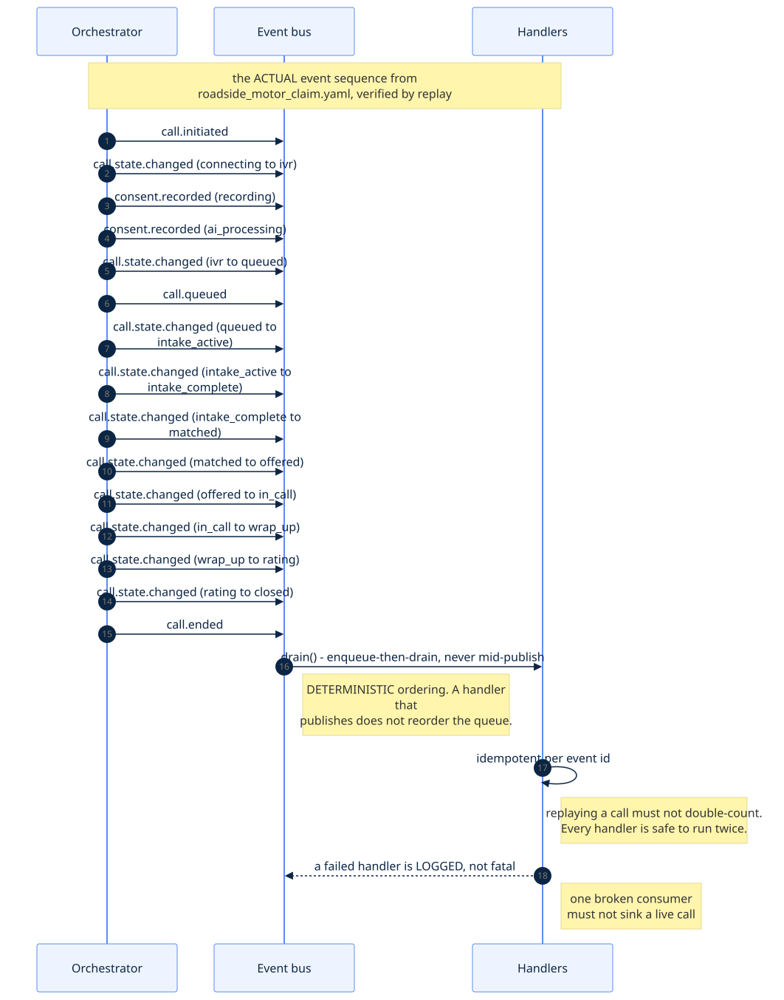

# 8. Data & events

_Every object in the system, where it is stored, and how the parts talk to each other._

← [Voice & AI](07_voice_and_ai.md) · [index](README.md) · next → [The project](09_the_project.md)

---

## 8.1 The domain model

**Generated from the pydantic models** — real class names, real field names, grouped by what
they are for. Large; treat it as a map to come back to rather than something to read
straight through.

The grouping is the useful part:

- **Bank data (read-only)** — `Customer`, `Policy`, `Coverage`, `Claim`, `Product`,
  `Interaction`, `Holding`, `LifeEvent`. We only ever read these.
- **Context we assemble** — `Customer360` gathers it, `ContextSnapshot` freezes it,
  `FieldProvenance` records where each field came from.
- **The call** — `CallSession` is the spine; everything hangs off `call_session_id`.
- **Speech** — `TranscriptTurn`, `IntakeResult`, `ExtractedEntity`.
- **What the agent reads** — `CaseBrief` and its parts.
- **Agents & matching** — including the breakdown objects that make a decision explainable.

Three details worth noticing:

**`Coverage` is a typed object**, not a string or a number on `Policy`. `kind`, `label_th`,
`amount`, `currency`, `unit`. This is `D16` enforced by the type system — there is nowhere
for a model-generated figure to live, because coverage is structured data read from a field.

**`CallSession.intent_id` is optional.** A cold call has no app intent, and that is the base
case, not an edge case (`D19`). Making it required would have quietly encoded "the app path
is the real path".

**`CallSession` carries `preferred_language` *and* `acceptable_languages`.** They differ
because a keypress tells you what someone *prefers*, not what they can understand — a
bilingual caller who picks English is still perfectly routable to a Thai speaker (`D38`).

---

## 8.2 Two stores, one of them untouchable

`D5` is the load-bearing constraint here: **the bank's data is read-only.**

On hackathon day we are handed someone else's real data in an unknown shape. Writing to it is
not a risk anybody gets to take, so the design makes it *impossible* rather than
*discouraged* — enforced twice over:

1. the `CoreDataProvider` port has **no write methods at all**, so there is no function to
   call even by accident;
2. the database role is granted `SELECT` and nothing else, so a hand-written query would be
   refused too.

Everything we produce — call sessions, consents, transcripts, briefs, matching decisions,
agent presence, wrap-ups, ratings, the disclosure audit log — goes in our own schema. Clean
separation also means the swap on hackathon day touches one adapter and a YAML field
mapping, not the whole system.

---

## 8.3 The event catalogue

**Generated from the event registry**, grouped by prefix. Events are how the parts of the
system talk without knowing about each other: the orchestrator publishes that a call changed
state; the brief builder, the workstation feed and the metrics rollups each react.

Every event is a versioned pydantic model, and decoding an unknown event name raises rather
than silently ignoring it — a silently dropped event is the kind of bug that takes a day to
find.

---

## 8.4 What one real call actually emits

Not illustrative — this is the verified output of replaying `roadside_motor_claim.yaml`.

Three properties the bus guarantees, each fixing a specific class of bug:

- **Enqueue-then-drain.** A handler that publishes an event does not reorder the queue
  mid-publish. Ordering is deterministic, which is what makes byte-identical replay possible.
- **Idempotent per event id.** Replaying a call must not double-count anything. Every handler
  is safe to run twice.
- **A failed handler is logged, not fatal.** One broken consumer must never sink a live call.

Today this is an in-memory implementation; Redis Streams sits behind the same port for
scale-out (`D15`), and the in-memory one stays as the deterministic test double.

---

← [Voice & AI](07_voice_and_ai.md) · [index](README.md) · next → [The project](09_the_project.md)
