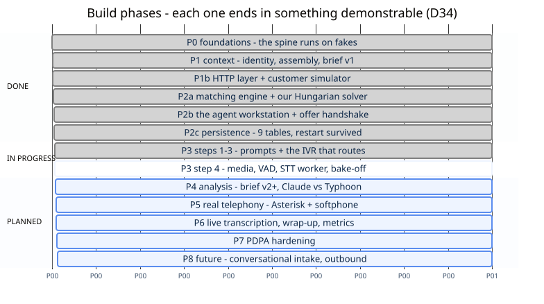

# 9. The project

_How it gets built, how it is kept honest, and why it is the way it is._

← [Data & events](08_data_and_events.md) · [index](README.md) · next → [Sessions & tokens](10_sessions_and_tokens.md)

---

## 9.1 The phases



Nine phases, and the sequencing rule behind them is worth stating: **each phase ends in
something demonstrable.**

That is why there is no separate demo project (`D34`). The original plan had one — build the
real system over here, build a stage demo over there. It turned out to be redundant, because
if every phase already produces a working slice, "the demo" is just the current state of the
system plus a chosen scenario. A second codebase would only be a second thing to keep in
sync, and the version you demo would drift from the version you built.

The ordering is also risk-driven. Telephony is the hardest, most fragile dependency, so it
lands at **P5** — late — and everything before it is built against a simulated adapter. No
phase is ever blocked waiting for a SIP trunk or a working microphone.

Current position: **P0 and P1 are done, P1b is next.**

---

## 9.2 How it is kept honest



441 tests, under two minutes, no services, no keys, no GPU, no network.

**Contract suites are the unusual layer** and the most valuable one. Every adapter for a port
must pass the *same* test suite. When the hackathon hands us real data and we write a new
`CoreDataProvider`, it either passes the suite or it does not ship. That is what converts
"swappable in principle" into "swappable safely".

**Scenarios replay byte-identically**, and the reason is `D35`: the clock and the id
generator are *injected*, never read from the wall. Nothing anywhere calls `datetime.now()`
or generates a random id on its own. Without that discipline, golden-output comparison would
be impossible and every scenario test would be flaky.

**`grep -rn "# P1:" scripts/`** lists every lifecycle step the scenario runner still performs
by hand — which is exactly the handover list for P2 and P3. The list of what is not yet built
is executable rather than prose, so it cannot quietly go stale (`D36`).

---

## 9.3 All 43 decisions



Grouped by what they govern. The full reasoning for each — problem, decision, alternatives,
tradeoffs — is in [`DECISIONS.md`](../DECISIONS.md).

If you read only five, read these:

| # | | Why it matters |
|---|---|---|
| **D3** | ports & adapters | makes hackathon-day unknowns survivable |
| **D37** | the keypad menu runs first | sets the floor at parity, and makes AI upside instead of risk |
| **D12** | the call is never blocked on AI | the entire degradation story follows from this one line |
| **D16** | figures are data, never model output | the single biggest product risk in an insurance context |
| **D20** | identity is an assurance ladder | why a phone number is not a login |

The discipline around this file matters as much as its contents: **a decision is never
silently reversed.** Reversing one means a new entry explaining why. That is what makes it
possible to come back in three weeks and understand not just what was chosen, but what was
already considered and rejected.

---

## 9.4 Where to go next

- **The written walkthroughs** — [`../explanations/P0_foundations.md`](../explanations/P0_foundations.md)
  and [`P1_context.md`](../explanations/P1_context.md) explain the code layer by layer, in
  prose, with the actual output.
- **The live state** — [`../NEXT_SESSION.md`](../NEXT_SESSION.md) is current priorities,
  open questions and landmines.
- **Run it yourself** — the fastest way to see the whole thing move:

```bash
uv run python scripts/run_scenario.py tests/scenarios/anonymous_declined.yaml
```

That one is the thin end of the wedge: an unrecognised number on the general hotline who
declines the recording. No identity, no consent, no transcript, no AI — and it still reaches
the right specialist queue with the right intent, from two keypresses. If that scenario ever
fails, the degradation ladder is broken.

---

← [Data & events](08_data_and_events.md) · [index](README.md) · next → [Sessions & tokens](10_sessions_and_tokens.md)
