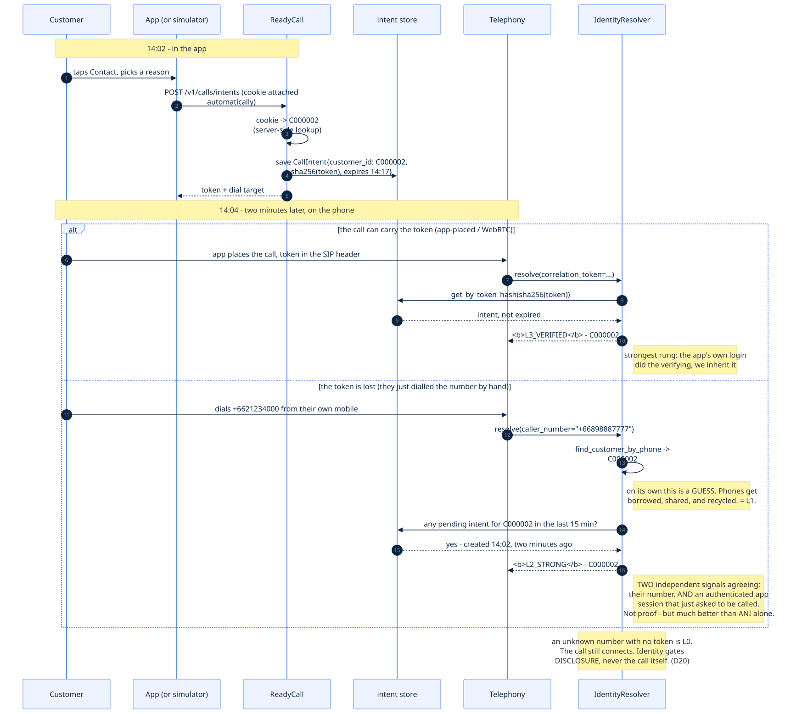

# 10. Sessions and tokens — how the system knows who is calling

_The question this page answers: if the client never sends a customer id, how does anything
know who anyone is?_

← [The project](09_the_project.md) · [index](README.md) · next → [Persistence](11_persistence.md)

---

## 10.1 The one idea

The whole mechanism is this:

> **The client holds an opaque reference. The server holds what it refers to.**

Nothing identifying is ever transmitted. The customer's phone holds a random string that
means nothing by itself; the server holds a private table saying what that string points to.



There are **two** such strings, for two different jobs:

| | the **session cookie** | the **correlation token** |
|---|---|---|
| proves | who is using the **app** | that this **phone call** belongs to that app session |
| lives | in the browser's cookie jar | in the app's memory, then on the call |
| sent | automatically, every HTTP request | once, carried by the call |
| lifetime | 1 hour | 15 minutes |
| stored as | the token itself (in memory) | **only its SHA-256 hash** |

They are separate because **a cookie cannot travel down a telephone line**. The moment the
customer stops talking to us over HTTP and starts talking over the phone network, the cookie
is useless — so the call needs its own single-purpose, short-lived credential.

---

## 10.2 Step by step, with what each side holds

### Step 1 — logging in

**Client sends:** `POST /v1/demo/session {"customer_id": "C000002"}`

Only the demo does this. A real login sends a password to Krungsri's identity provider, and
we never see it. Either way the *result* is the same shape.

**Server does:**

```python
token = secrets.token_urlsafe(24)          # 192 bits of CSPRNG randomness
self._sessions[token] = (customer_id, expires_at)
response.set_cookie(..., value=token, httponly=True, samesite="lax")
```

**Server now holds:** `OB3kL9… → ("C000002", 22:15)`
**Client now holds:** a cookie it cannot read — `HttpOnly` means the page's own JavaScript
gets an empty string from `document.cookie`. Even a successful XSS on our page cannot
exfiltrate it.

### Step 2 — every subsequent request

**Client sends:** nothing extra. The browser attaches the cookie automatically. The
simulator's `fetch` calls use `credentials: "same-origin"` and never touch the value.

**Server does**, before the route body runs:

```python
async def get_principal(request, container) -> Principal:
    token = request.cookies.get(container.settings.session_cookie_name)
    return await container.sessions.resolve(token)   # -> Principal(customer_id=...)
```

If the cookie is missing, unknown, or expired: `401`, and the route never executes.

### Step 3 — tapping Contact

**Client sends:**

```json
{"product_code": "KS-MOTOR-1ST", "app_intent": "motor.claim.accident"}
```

Note what is absent. There is **no `customer_id` field in the schema at all**, and
`extra="forbid"` makes sending one a `422` rather than a silently ignored key. The client
*cannot* assert identity — not "is not trusted to", *cannot*.

**Server does:** takes `customer_id` from the `Principal` (step 2), mints a second random
string — the correlation token — and stores:

```python
CallIntent(
    customer_id="C000002",
    correlation_token_hash=sha256(token),   # the token itself is NOT stored
    expires_at=now + 15 minutes,
)
```

**Server returns the plaintext token exactly once.** It is never readable again — there is a
test asserting it does not appear in any later response.

### Step 4 — the phone call

Now the customer dials, and there are two paths.



**If the token survives** (the app placed the call, so it can put the token in the SIP
header): we hash what arrives, look it up, and get `customer_id` back. That is
**`L3_VERIFIED`** — the top rung — because the *app's own login* did the verifying and we
are inheriting it.

**If the token is lost** (they just dialled the printed number by hand, which is the common
case): caller ID gives us a *guess*. Phones get borrowed, shared, and — especially with Thai
prepaid — recycled, so on its own that is only **`L1_PROBABLE`**.

But then the resolver asks one more question:

> *Is there a pending intent for this customer, created in the last 15 minutes?*

If yes, we have **two independent signals agreeing**: this phone number belongs to C000002,
**and** an authenticated app session belonging to C000002 asked to be called two minutes ago.
Not proof — but far better than either alone. That is **`L2_STRONG`**, and it is the rung at
which policy details unlock.

This is the answer to *"how does it know the customer pressed and has a pending app intent?"*
— it does not need the caller to tell it anything. It looks up their number, then checks its
own records for a recent request from that same customer.

---

## 10.3 Why this is hard to attack



Each of those defences is a test in `tests/unit/test_api.py`, not an intention.

The properties that matter, in order of importance:

1. **The customer id is never on the wire, in either direction.** There is no message to
   intercept and no field to tamper with, because identity is derived server-side from a
   reference that means nothing anywhere else.
2. **The tokens are unguessable.** `secrets.token_urlsafe(24)` is 192 bits from the OS
   CSPRNG. Comparison uses `hmac.compare_digest`, so lookup time does not leak how much of a
   guess was correct.
3. **A database leak yields no working call tokens**, because only SHA-256 hashes are stored.
4. **Everything expires**, and — importantly — an expired token *falls through to a weaker
   rung* rather than erroring. It never grants, and it never breaks the call.
5. **Failures are indistinguishable.** Unknown session and expired session both return a bare
   `401`. Someone else's intent returns `404`, the same as one that does not exist.

### And what is *not* solved, honestly

This is a hackathon build and the write-up should say so:

- **Sessions live in a Python dict.** Restart the process and everyone is logged out. P2
  moves them to Postgres/Redis with the DB layer (`D39`).
- **No CSRF token.** `SameSite=Lax` covers the same-origin demo; production wants a real
  double-submit token.
- **No TLS locally**, so the cookie has no `Secure` flag yet. In production both are
  mandatory — a session cookie over plain HTTP is a credential in the clear.
- **The demo login is a persona picker, not authentication.** It verifies nothing. It exists
  so the simulator can *become* a customer.

What is real is the **shape**: server-side issuance, server-held mapping, HttpOnly transport,
hashed call tokens, expiry, and a `SessionResolver` seam. Swapping in Krungsri's OIDC changes
one adapter and nothing else — which is exactly why the endpoints cannot tell a demo session
from a real one.

---

← [The project](09_the_project.md) · [index](README.md) · next → [Persistence](11_persistence.md)
