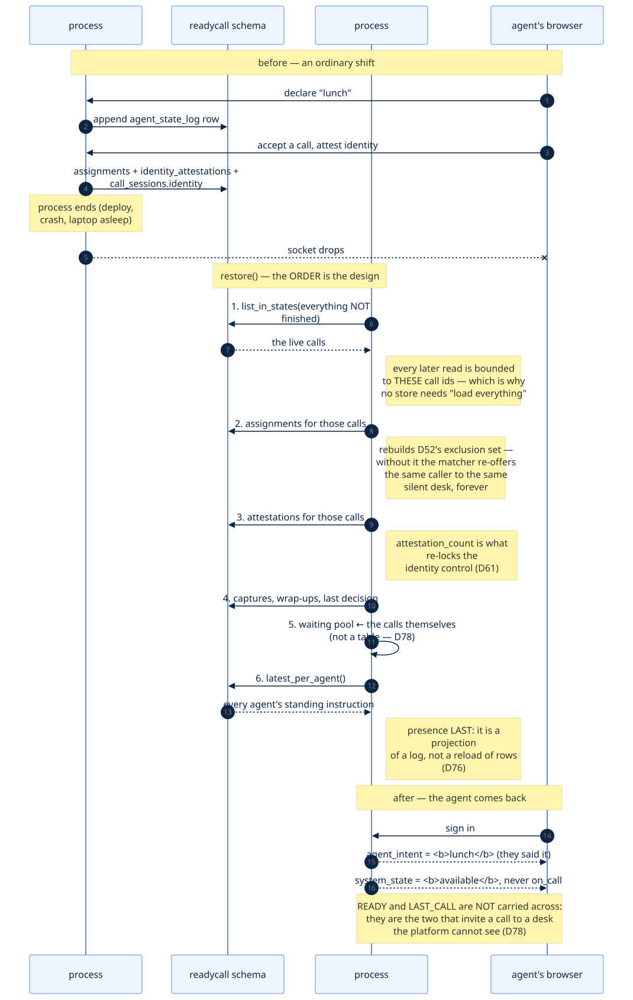

# 11. Persistence — the half you cannot see

_The question this page answers: **what actually happens when the server restarts, and why
does only some of it come back?**_

← [Sessions & tokens](10_sessions_and_tokens.md) · [index](README.md)

---

Every other page in this folder describes something you can watch happen — a caller moving
through a menu, an offer appearing on a desk, a brief filling in. This one describes the
part that has no screen. It runs when nothing is looking, it is invisible when it works, and
the only way you notice it is when a demo comes back wrong after a laptop went to sleep.

So it is drawn rather than described.

---

## 11.1 What is stored, and what is deliberately not



**Generated from `Base.metadata`** — real table names, real primary keys, real indexes, real
column counts, read off the SQLAlchemy models themselves. If somebody adds a table without
adding a reason, it appears here on the next regeneration.

**Eleven tables**, in five groups (nine landed with P2c; `audio_recordings` and
`transcript_turns` joined them on 2026-09-06, `D110` and `D114`):

- **the call** — `call_sessions` is the spine; `call_state_transitions` is the timeline that
  makes `D18`'s "context was ready before the phone rang" a fact you can print rather than a
  claim; `context_snapshots` is the frozen `Customer360` the brief is re-rendered from.
- **the agent side** — `agent_state_log` (append-only), `assignments` (the offer handshake,
  with every measured timestamp), `call_wrapups`.
- **the record** — `identity_attestations` and `keypad_captures`. Between them these two
  answer the question a regulator actually asks: *on what basis did an employee decide it was
  safe to talk to this caller?*
- **explainability** — `matching_decisions`, including for the calls we chose **not** to
  assign (`D50`).
- **what the caller actually said and sounded like** — `transcript_turns`, written one
  sentence at a time as they are spoken (`D114`), and `audio_recordings`, which is an
  **index and never the audio**: where the object is, which *master* key wrapped that
  object's own data key, and the date after which it must be deleted (`D110`, `D14`).
  Someone who reads that table learns a recording exists and can decrypt none of it.

The yellow boxes on the right are the interesting half. **They are not tables, on purpose**
(`D78`), and each one is computed from a table that already exists:

| Not a table | Computed from | Why not store it |
|---|---|---|
| current presence | newest `agent_state_log` row per agent | two places recording one fact will disagree, and the log is the one that answers *"what was true at 14:03"* (`D76`) |
| the waiting pool | `call_sessions` in `queued`/`matched` | a `queue_entries` row would be a second answer to *"is this caller waiting?"* — `call_sessions.state` is the first |
| the live identity | `CallSession.identity` | the column already exists and is already durable |
| accrued wait | recomputed from `queued_at` | a stored counter would **reset** a caller who sat through our outage; recomputing makes them *more* urgent, which is what `D22`'s urgency term is for |

The rule underneath all of it, since it will be asked again:

> **A table records something a person or a service DID. Anything computable from those
> records is derived.**

---

## 11.2 Write-through, and the road not taken



The obvious way to "add persistence" is to make the services read from the database. That
was rejected, and the reason is not performance folklore — it is that **every one of these
services has synchronous readers on the hot path**:

```
AssignmentService.excluded_agents(call)   ← inside the matcher tick, every second
AttestationService.history(call)          ← on every workstation snapshot
DispatchService.waiting()                 ← on every tick
```

Making those `await` a query puts a round trip inside a 50 ms budget and ripples `async`
through every router that reads. So instead: **write through on every mutation, read from
memory, rebuild at startup.**

Three things make that honest here rather than merely convenient:

1. **One writer per store, one process** (`D2`). The usual reason to read through is that
   somebody else might have written. Nobody else can.
2. **`D76` already made this choice** for presence, with its reasoning written down. Doing
   it differently for the other five stores would leave two durability models in one
   codebase, which is worse than either one.
3. **`D39`'s trigger has not fired.** It says revisit *"the moment two processes need to see
   the same call"* — at which point the working set stops being a projection and becomes a
   cache with an invalidation problem, and the answer is Redis or read-through, with its own
   decision entry.

The tradeoff is stated rather than hidden: if a write throws after the in-memory mutation,
the two disagree for one process lifetime, and the next restore corrects it — because the
**durable record is what gets rebuilt from**, never the other way round.

---

## 11.3 A restart, step by step



The order in `Container.restore()` is the design, not an implementation detail.

**Live calls first**, because every other store is then loaded *for those call ids*. That is
why none of these stores needs a "load everything" method: a shift of closed calls is
history, history is answered with SQL, and pulling it into a process buys nothing.

Two steps in the middle are worth naming, because both look like bookkeeping and are not:

- **Rebuilding `D52`'s exclusion set.** Without it, a restart forgets that A001 already let
  this offer time out. The global matcher re-solves, reaches the same optimum, and offers the
  same caller to the same silent desk — the exact loop `D52` exists to break, reintroduced by
  an outage. Every individual decision would look defensible while the caller waits forever.
- **Restoring `attestation_count`.** It is what re-locks the identity control after every
  amendment (`D61`). A restore that came back with an empty history would silently *unlock*
  the identity panel on a call that had already been attested — a lock that opens by itself
  is worse than no lock, because the screen says the question is settled.

**Presence comes last** because it is the only step that is a projection of a log rather
than a reload of rows.

---

## 11.4 What comes back, and what correctly does not



The left column is the point of the phase. The right column is the part worth arguing about,
so here is the argument.

**`system_state` returns `OFFLINE` for everyone.** That axis describes what the *platform*
has given the person to do, and after a restart it has given them nothing: no socket, no
offer, no call. Restoring `ON_CALL` from a log row would assert a conversation that is not
happening and let the matcher count a desk that is not there — which is precisely the failure
the heartbeat sweep exists to prevent (`B7`), arriving through a different door.

**`READY` and `LAST_CALL` do not carry across, but *lunch* does.** Signing in after a restart
preserves the standing instruction, with those two excluded because they are the only values
that make the platform send someone a call. This does not weaken `D51`:

> the platform is not *writing* the person's axis, it is declining to overwrite it. The write
> it makes is `OFFLINE → AVAILABLE`, on its own axis, and the intent rides along unchanged
> exactly as it does on every other platform move.

`D51` forbids inventing a state the person did not choose. Lunch is what they chose.

**And an absence can be data.** No `call_wrapups` row means the call was never wrapped up,
which is true and useful. `D45` struck out an auto-save precisely so that stays true — a
restore that invented one would replace a fact with a fabrication.

**What is new since this page was written: the caller's own words and voice now survive
too.** `transcript_turns` is written a sentence at a time as they are spoken (`D114`), so a
call that ends badly still leaves the text it produced; and a consented recording is an
encrypted object with a row pointing at it (`D110`). Neither is *restored into memory* at
startup, and that is deliberate — nothing reads them on a hot path. They are the record,
not the working set (`D78`'s distinction, applied one layer out).

This is also the first time the two-axis model (`D33`) has had to do real work. It was
introduced to tell *"they chose break"* apart from *"nobody picked up"*; it turns out to be
exactly the distinction a restart needs.

---

## 11.5 The one place "just store it" was wrong



Everywhere else in this codebase the safe move is to record what happened. Keypad capture is
the exception, and `D44` is why: **capture is untyped**. The agent starts it, the caller keys
whatever they have, the agent stops it. Until something identifies those digits they could be
a policy number, a citizen id, or a card number — so an unidentified number is treated as
sensitive.

Writing the table turned that into a column decision:

| always stored | stored only once named |
|---|---|
| `masked` = `••••••0811` | `digits` = `2024000811` |
| `digit_count` = `10` | |
| the lookups and their outcomes | |

"Named" means a lookup matched or the agent labelled it — at which point the digits *are* a
policy or claim number, which is not a secret and is worth having in the record.

The consequence is visible and intended: **a restart mid-capture gives the agent back the
fact that a capture happened and how long it was, never the digits.** `D44` asks for short
retention and one-click discard, and a durable copy of an unknown number is the opposite of
both.

Note this is a different question from the disclosure gate. `mask()` protects the **log**,
never the agent (`D58`) — these are the caller's own keystrokes, typed seconds ago, to the
person they are speaking to.

---

## 11.6 Three backends, one suite



`STORAGE_BACKEND` picks a set of stores, and **`memory` is not "no persistence"** — it builds
real in-memory stores, so the write-through path runs on the default configuration and in
every test rather than only when somebody remembers to start a container. That is exactly the
shape that produced `B7`: code that was correct and never ran.

The contract suite runs the same assertions against all three. It caught a real divergence
within an hour: **SQLite ignores foreign keys unless asked**, so an orphan row was refused by
Postgres and cheerfully accepted by SQLite — the same test passing on one backend and failing
on the other. A fast path that enforces *less* than production is worse than no fast path,
because it turns a real constraint into one that only appears in production.

---

## 11.7 How the claim is actually proved

A per-store contract suite proves each store round-trips. It would have passed just as happily
on `B7`'s three services that were correct and driven by nothing — so it is **not sufficient**
for a claim about restarting.

`tests/integration/test_restart.py` does the only thing that is: boot a real app, work through
the real HTTP API, **throw the app away**, boot a second one on the same storage, and ask it
what it knows. No shared container, no shared service, nothing that could answer from a cache
it happens to still hold.

Then re-verified outside pytest, because `TestClient` is still one Python process: two real
uvicorn processes against a live Postgres, the first one killed mid-shift.

```
PASS  the call itself came back
PASS  the attested identity came back
PASS  last_call did NOT carry across
PASS  the brief still renders
PASS  the Thai summary is identical
```

---

## 11.8 Two bugs this phase found, neither of them about databases

**`CallSession.identity` had existed since P0 and nothing ever wrote it.** The live resolution
lived only in a dict on the API container, so a restored call had no identity, so
`render_brief` returned `None`, so **the agent's screen was blank on a call they were in the
middle of.** The column was right, the model was right, and the write was simply missing —
findable only by restarting and looking.

**And the phase before this one shipped with its database models never committed** (`B9`).
`.gitignore` contained `models/` under a heading meaning ML weights; a gitignore pattern with
no internal slash matches a directory of that name at *any* depth, so it also matched
`src/readycall/db/models/`. A whole phase looked landed and a fresh clone had no tables.

That one belongs on this page because of what it says about verification generally:

> Every check this project runs — tests, `mypy`, `ruff`, the migration, the live Postgres
> verification — reads the **working tree**. None of them is a statement about what the
> repository contains.

It joins the family `NEXT_SESSION` already names — `B3`, `B4`, `B6`, `B7`, `B8` — *a
confident, plausible, wrong result nobody looked at.* `B9` just adds a new hiding place.

---

## Where to go from here

- **`../reading/persistence.html`** — a **readable, interactive twin** of this page. Open it
  in a browser, no build step. It carries a *restart simulator*: build up an ordinary shift,
  pull the plug, and watch each fact resolve to survived or gone **with its reason**. That is
  the closest this subsystem gets to something you can poke at, which is most of why it
  exists. This page and that one must be updated together.
- `explanations/P2c_persistence.md` — the same material at length, with the alternatives
  that were rejected and why. Part 2 covers this phase.
- `DECISIONS.md` `D75`–`D79` — the decisions themselves.
- `DATA_MODEL.md` — every table, including the ones that are still design.

---

← [Sessions & tokens](10_sessions_and_tokens.md) · [index](README.md)
