# 12. The line — what the caller actually hears

_The question this page answers: **the menu decides where the call goes. What does it
sound like, and what happens when the caller does something unexpected?**_

← [Persistence](11_persistence.md) · [index](README.md) · [why the menu leads](04_routing.md)

---

[Routing](04_routing.md) explains *why* the keypad menu runs before any AI, and draws the
tree it walks. This page is the layer underneath: the actual sentences, where they come
from, and the machine that plays them. It is the second part of the system with no screen —
the caller hears it, and nobody on the team ever does.

Two things turned out to be more interesting than they looked, and both came from the same
sentence in `D37`: *a recognised caller hears their likely options first*.

---

## 12.1 Every sentence is text in one file



`D24` chose pre-rendered TTS over both alternatives, and the reasoning is worth restating
because it is a demo-day decision as much as an engineering one:

- **not hand-recorded**, because then changing a word costs a studio booking, and wording
  is exactly what gets tuned the night before;
- **not synthesised during the call**, because that is latency, cost, and a network
  dependency standing between a caller and a menu — on a venue's wifi.

So: edit Thai in YAML, re-render, hear it a second later, and the call itself makes no
network request at all.

**The cache key is `hash(text, voice, engine)` — not the prompt id.** That one choice does
two jobs. Editing a single line re-renders exactly that line and reuses the rest —
measured, not claimed. And two prompts that say the same words become **one clip**: the
option line *"กด 3 ติดตามสถานะเคลม"* is key `3` in both the motor and the health reason
menu, so it is rendered once and played by both. That dedupe is not an optimisation
detail — it is what collapses one clip per menu entry into one per distinct sentence.

The manifest is committed and a test asserts it is fresh, the same argument as the
generated diagrams: a pack that ships stale is worse than no pack, because the caller hears
last week's wording and nothing says so.

> **Where the real audio is.** `TTS_ENGINE` defaults to `null`, which records what it was
> asked to say and synthesises nothing — so today this is a manifest, not a playable pack.
> A real voice is a config change and a re-run, chosen on a listening test of these actual
> 63 lines rather than on a spec sheet.

---

## 12.2 Who asks for which line



**Generated** from the three config files, so it cannot drift. The boxes are less
interesting than the arrows: a prompt id is a string written in one file and defined in
another, and this is the only place that join is visible.

Three sources point at prompts, and each is a different kind of reference:

| Points at a prompt | Because |
|---|---|
| **a role** (`intake_offer`, `no_input`) | the IVR asks for a *role*, never for an id. Renaming a prompt is a config edit, and `services/` carries no prompt literals (`D28`) |
| **a menu** (`menus.yaml`) | each menu names its lead-in |
| **a published number** (`dids.yaml`) | the number someone dialled is the first thing we know about them (`D19`), so it is the first thing that shows |

An orphan would appear here as a box nothing points at. There are none, and a test in both
directions keeps it that way — the same guard `D72` put on `challenges.yaml`, because a
list enforced on one side and read from the other drifts unless something checks. The
failure it prevents is silent in the worst possible place: config loads, tests pass,
routing is correct, and the caller hears a gap where a menu should be.

---

## 12.3 A menu is not one clip



Here is the collision. `D24` says every line is a pre-rendered file. `D37` says the order
of the options changes per caller. Both cannot be true of a single baked recording of
*"กด 1 ประกันรถยนต์ กด 2 ประกันสุขภาพ …"*.

So a menu is **composed** from clips that were all pre-rendered (`D80`): a lead-in, one
option line each, then the reserved-key hint. Composition is playback, not synthesis —
`D24` holds exactly as written.

The version that was rejected is worth naming: *one clip per menu per ordering*. The
product-line menu alone has five options and therefore 120 orderings, and every wording
edit multiplies by all of them.

What composition bought, beyond making reordering possible at all:

- **the label exists in exactly one file.** `voice_prompts.yaml` contains no menu options;
  the build reads them from `menus.yaml` — the same file that does the routing. There is no
  second copy of "ประกันสุขภาพ" to drift.
- **32 prompts and 32 menu options come to 63 clips.** "ติดตามสถานะเคลม" is key `3` in both
  the motor and the health menu, so it renders once.

### The trap underneath it

`D37` says promoted options *take the low numbers*. So when travel is promoted, **`1` means
travel — on that call only.** `CallSession.menu_path` records keypresses, so a stored
`("1", "3")` would mean different things on different calls. Everything downstream — the
brief, the intent source, a replayed scenario, an auditor asking what the caller chose —
would be quietly wrong, and nothing would fail.

`D81` resolves it at the only moment where the answer is unambiguous: **every press is
translated back to its canonical option the instant it arrives.** `menu_path` therefore
always holds the keys as `menus.yaml` spells them. The raw presses are kept separately, as
a UX signal rather than routing evidence.

The same rule reaches into the test suite: `ScriptedChoices` — used by every scenario file
— takes **canonical** keys and looks up whichever key is actually under that option. A
scenario keeps meaning what it says when a menu is reordered, instead of silently pressing
the wrong thing.

And the reason for renumbering rather than merely shuffling: *"กด 3 … กด 1 … กด 2"* makes
the caller do the sorting. If the order changes, the numbers change with it.

---

## 12.4 The walk, and everything a caller might do instead



The solid path is the one everybody draws. The **dotted paths are the product**, because
`D37`'s claim is not "the AI works" — it is *parity with an ordinary call centre*, and
parity means the awkward cases are handled at least as well as a system with no AI in it.

| The caller does | What happens | Why that rule |
|---|---|---|
| presses `0` **expecting an operator** | hears the menu again rather than an apology (`D90`) | the way out is the menu's own spoken **"เรื่องอื่นๆ"**, which every reason menu ends in. `D86` removed the operator because it routed exactly where the catch-all routes; `D90` then put repeat on the freed key, so the old habit now buys something useful |
| presses `0` | hears the menu again, and it costs nothing | re-listening is being careful, not failing — and `0` is where a lost caller's thumb already goes (`D90`) |
| presses a wrong key | apology naming both escape keys, then the menu again — **with no limit** (`D82`) | a wrong key *proves* somebody is there. Giving up after N mistakes throws away the good answer we were seconds from getting |
| says nothing | one re-prompt, then a queue | silence does **not** prove anybody is there, so this half stays bounded |
| says nothing on a product-line number | that **line's** queue, not the general one (`D40`) | they told us something; throwing it away is worse service than using it |
| hangs up | recorded as abandoned, never as routed | the record should not claim a choice nobody made |

**Every dotted path still ends in a queue.** That is the floor the whole AI layer sits on.

**And there is no identity step in here** (`D84`). An earlier design had the caller key the
last four of their citizen id to reach L3. It was removed: an automated check that promotes
with **no human in the loop** is exactly what `D44` refuses — *a lookup returns evidence,
never an action, and only the agent attests.* The agent's own keypad capture does the same
job during the call, with judgement attached.

Two orderings on this diagram are not stylistic. The **recording notice comes before any
menu**, on every call, whichever number was dialled — and it is not the same thing as
consent to AI processing, which is its own scope and its own keypress (`D14`). And the
question *"do we already know?"* comes first, because asking someone a question we know the
answer to is bad service, not thoroughness (`D48`).

### One thing the machine deliberately does not claim

A DID may assume an intent — someone dialling the number printed in their glovebox is
very likely standing beside a damaged car (`D19`). That assumption is real evidence and it
picks the queue. But it is weaker than a keypress, so the two are kept apart:
`outcome.intent_code` holds **only what was pressed**, and `IvrResult.intent_code` carries
the best answer available with `intent_source` saying where it came from — `dtmf`, `app`,
`did`, or `none`. The agent's brief needs to tell *"they told us"* from *"we assumed"*.

---

## 12.5 How it is actually driven

The machine has no I/O in it. `begin` / `on_digit` / `on_timeout` / `on_hangup` each return
*what to play next*, and a thin async driver plays it.

That shape is a direct consequence of `B7`. An IVR written as a coroutine awaiting DTMF can
only be tested by feeding it a fake phone line — and the rungs that fire **because time
passed** are then the ones that quietly end up driven by nothing. Here, a timeout is an
ordinary method call:

```python
first = machine.on_timeout(run)     # re-prompt
second = machine.on_timeout(run)    # -> EXHAUSTED, reason="silence_x2"
```

Both places that used to fake the walk now call the real service. The scenario runner's
`# P1:` marker for the IVR is retired, and so is the demo endpoint's `# P2b:` — the only
thing still faked is what a caller genuinely supplies: the number dialled and the keys
pressed.

```
anonymous_declined     17 lines played   keys 2/4   -> q_health_policy   (dtmf)
roadside_motor_claim   10 lines played   keys 1     -> q_motor_claim     (dtmf)
pattheera_ipd           2 lines played   keys -     -> q_health_ipd      (app)
```

Two lines for the app path is the whole of `D48` in one number: a greeting, a recording
notice, and not a single question.

---

## 12.6 What happens once the queue is known

The menu stops here. Everything below is **enrichment**, and the page it is on matters: a
separate machine, `services/intake/hold.py`, with a separate outcome type, because the IVR
decides *where the call goes* and this decides *how much the agent will know when it gets
there* (`D88`).



The caller hears a plain **"please hold"** and then the offer — **no position and no wait
estimate** (`D91`, reversing `D89`). There is no line to have a position in: the matcher
builds a full call × agent matrix and re-solves it with the Hungarian algorithm every tick,
so arrival order is not an input anywhere and both overtaking directions happen by design.
A 200-second waiter beats a fresh CRITICAL caller on urgency alone; a fresh CRITICAL caller
who reaches a specialist beats the waiter on `fit × urgency`. Either way an announced number
is a promise the system breaks — most often for the low-urgency callers most likely to have
believed it.

`D89`'s mistake is the instructive part: *"we can count a queue exactly"* is true, and
irrelevant. **Counting a pool is not ranking it.**

### The three answers, and why none of them is a failure

| They press | What happens | What the agent gets |
|---|---|---|
| **1** | `recording` **and** `ai_processing` granted on one keypress, basis `ivr_keypress_1`; the call moves to `INTAKE_ACTIVE` | a transcript, once there is audio |
| **2** | `ai_processing` recorded as **`granted=False`** — the refusal, not silence | a menu-derived brief, marked `intake_declined` |
| *nothing* | one line: "please hold" | a menu-derived brief, marked `no_consent` |

The last two rows are the point. *"They said no"* and *"we never asked"* are different facts,
and a call whose consent list is simply empty cannot tell you which happened — so an agent
looking at a thin brief would have no way to know whether to ask. Both are outcomes, not
errors: the queue was settled before any of this ran, and a test asserts exactly that.

```python
for keys in (["1"], ["2"], []):
    ...
assert queues == ["q_health_policy"] * 3
```

### The recording outlives the thing that started it

`run_offer` returns the moment the caller answers. That looks like an unfinished loop and is
the opposite: the three things that actually end a recording are a **VAD silence**, the
**maximum duration**, and **an agent pressing Accept** — and the last arrives seconds later,
from a different person, on a different connection (`D21`). So the hold stays live, and
`api/routers/agent.py` finalises it on accept, *before* the assignment is accepted, so the
tail of the transcript is attached to the call the agent is about to see.

Verified on a running server rather than argued about:

```
intake started    call_01M1C7KX…  strategy=passive
hold settled      … outcome=waiting  recording=True     <- offer out, still talking
intake finalized  … partial=True  reason=offer_accepted <- the agent pressed Accept
hold settled      … outcome=cut_short recording=False
```

`is_partial` matters downstream: a brief must render *"cut off mid-sentence"* differently
from *"finished their thought"*, and under a busy queue the first is the **expected** ending.

### What is still missing here

**The audio arrived** (`D96`, 2026-09-02). There is a media gateway, a VAD port with two
adapters, an endpointer, a transcription service and three real STT engines — and since
`D104` a chosen one, Typhoon, which meets the latency budget on every call measured.
`IntakeService.on_turn` is fed for real, not only by the test suite and the scenario runner.

What is still missing is **the last hop to the screen**: `on_turn` hands the turn to the
intake strategy and publishes nothing, so `api/realtime.py` never sees it and the
workstation cannot draw it. The turns exist and are ordered; nobody forwards them.

Also still missing: the encrypted recording to object storage (P7's key management), and
`_degradation()` returning `NONE` even though `TranscriptionService` now knows whether the
engine failed.

---

## Where to go from here

- **`../reading/the_line.html`** — a **readable, interactive twin** of this page. Open it in
  a browser, no build step. It carries a **working keypad**: pick a number, pick a caller,
  and press your way through the real menu while it shows you every Thai line that plays and
  every press being resolved back to canonical. Switch the caller to *recognised* and the
  numbers move under you — which is `D81` as something you can do rather than read. That is
  the closest this layer gets to something you can poke at, which is most of why it exists.
  This page and that one must be updated together.
- **`../reading/the_offer.html`** — §12.6 above in plain language, for a reader who wants
  the *why* before the mechanism: where the line across the call is, the three answers and
  why none of them is a failure, and the two things that were wrong the first time.
- **[Routing](04_routing.md)** — why the menu leads at all, and the tree it walks.
- **[Voice & AI](07_voice_and_ai.md)** — the strategy seam the offer feeds, and what
  runs on the transcript once there is one.
- `explanations/P3_voice.md` — the same material at length, with what was rejected.
- `DECISIONS.md` `D24`, `D37`, `D80`, `D81`, `D86`, `D88`, `D89` — the decisions themselves.

---

← [Persistence](11_persistence.md) · [index](README.md)
