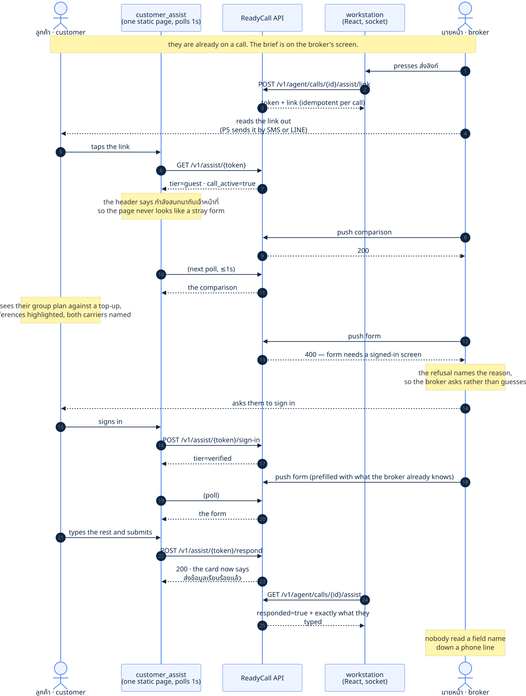

# 13. The broker, and the customer's screen

_The question this page answers: **we are a broker, not an insurer — what does that
actually change? And what is this thing where the broker puts a form on the customer's
phone?**_

← [The line](12_the_menu.md) · [index](README.md) · [routing](04_routing.md) · [voice & AI](07_voice_and_ai.md)

---

Everything on this page landed on **7 September 2026**, in one day, and it is the largest
change of direction the project has had. Four decisions: `D117` (the domain is a broker's),
`D118` (playbooks move to config), `D119` (the LLM actually runs) and `D120` (the call is
bound to the customer's screen).

If you read one section, read **13.1** — the rest follows from it.

---

## 13.1 A broker is not a small insurer

This is Krungsri's own slide, from the orientation deck (p.30), and it is the reason
everything else on this page exists.



Read the right-hand column carefully. Two entries are doing all the work:

- **คัดสรรแบบประกันและบริษัทฯ ที่ตรงตามความต้องการ** — select the plan *and the company*.
  A broker's job is comparison across carriers. That is not a feature we added; it is the
  definition of the business. And the brief marks it as **LEAK สูงสุด**, the biggest leak
  in the journey.
- **ติดตามการต่ออายุกรมธรรม์** — chase renewals. **72.55% of life premium is renewal, at
  84% persistency** (`MARKET_FACTS` §6). One policy in six lapses a year.

And read what is on the *left*: **ชดใช้ค่าสินไหม** — adjudicating and paying claims is the
insurer's. Not ours. Before `D117` the system had `motor.claim` and `health.claim` skills,
a `q_health_ipd` queue for pre-authorisation, and intents like `health.claim.submit` — a
single insurer's call centre, wearing a broker's name.

> **Why this matters more than it sounds.** *"We are a broker"* is a positioning sentence.
> *"Claims are the insurer's, so a claim call ends by handing over"* is a different queue,
> a different skill, a different playbook, a different wrap-up disposition, and a
> **different sentence on the agent's screen before they speak**. The first is a slide; the
> second is a system.

**The whole change was `config/` plus one domain field.** No service logic moved. That is
`D28`'s promise arriving on schedule, and it is the strongest feasibility evidence in the
pitch — retargeting this machine is a config swap, and here is the receipt.

---

## 13.2 The five shapes a broker call takes



The **endings** are the point of this diagram. Three shapes end with us, one ends with a
supervisor, and one ends somewhere else entirely.

`handoff_to_insurer: true` travels from `config/intents.yaml`, through `IntentSpec`, onto
the domain `IntentPrediction`, out through `BriefOut`, and onto the workstation as a banner
above the policy panel:

> เรื่องนี้ต้องส่งต่อบริษัทประกัน — เราช่วยรวบรวมข้อมูลและประสานงานให้

It is shown **before the broker starts talking**, because *"I'll check and call you back"*
and *"I'm passing you to the insurer now"* are different promises and only one of them is
ours to make.

### The one field that makes this a broker's record

`Policy.insurer`. A single company's system has no use for it — every policy in it is
theirs. A broker holds one customer's cover across several carriers, and *which carrier*
decides who a claim is handed to and whose terms a comparison is against.

The demo customer now holds a real **portfolio**: employer group health capped at
฿1,500/day from one carrier, a second health policy from another, and motor from a third.
Real names and market shares from `MARKET_FACTS` §8.

> ⚠️ **The Krungsri-affiliated carrier is deliberately one row among several, and
> sometimes not the best answer.** A broker whose affiliate always wins is not a broker,
> and the honest version is the one that survives being asked about.

---

## 13.3 What the agent should *do* now lives in config

`D118`, closing `Q19`. The recommended-action lists used to be a Python dict inside
`services/brief/builder.py` — insurance content in a service, against `D28`, with a comment
admitting it. Fine at six short lists; not at twenty-four.

They are `config/playbooks.yaml` now, and **guarded in both directions at startup**: an
intent naming a playbook that does not exist refuses to boot, *and so does a playbook no
intent reaches*. The one-way check is the half that never catches dead domain content
somebody keeps editing.

The steps encode the broker rule directly. None of them says *approve*, *is covered*, or
quotes a premium. Where the insurer owns the outcome, the last step says so out loud:

```yaml
health_claim_notify:
  - { text_th: "สอบถามโรงพยาบาลและวันที่เข้ารับการรักษา", needs: l0 }
  - { text_th: "ตรวจสอบวงเงินค่าห้องและความคุ้มครองตามที่บันทึกไว้", needs: l2 }
  - { text_th: "ระบุบริษัทผู้รับประกันและแจ้งขั้นตอนขออนุมัติล่วงหน้า", needs: l2 }
  - { text_th: "อธิบายเอกสารที่ต้องเตรียม และย้ำว่าการอนุมัติเป็นของบริษัทประกัน", needs: l0 }
```

`needs` is the assurance gate from `D74`: an `l2` step is one that *acts on* a policy, and
it is **absent** rather than greyed out below that level. At L1 the caller above sees three
steps, not four.

---

## 13.4 The AI summary, and the four ways it does nothing



`D119`. Count the boxes that end in "return None" — there are six, and **that is the design
rather than a weakness**. On a laptop with no API key it is the only path, and everything
downstream has to be correct when it is taken.

Three rules, all inherited from decisions made before there was a model to break them:

| rule | where it shows |
|---|---|
| **`D12`** — the call is never blocked on AI | started by `accept_offer` as a fire-and-forget task and **never awaited**. The agent is connected the instant that endpoint returns |
| **`D16`** — no model-generated number reaches the screen | the prompt forbids figures, and a guard refuses the output if one appears anyway. The guard assumes the prompt will one day fail |
| **`D13`** — a confidently wrong brief is worse than none | `is_clear: false` is believed, and a refused summary leaves the rule-based one, which quotes the caller verbatim |

> **The read path never calls a model.** `brief_snapshot` runs on every `/me` and every
> socket push, so summarising there would hit the provider dozens of times per call.
> `summarise_call` computes once and caches; the read path only *prefers* what is already
> there.

**Measured, live, on `claude-sonnet-5`: 4.5 s, 1,561/256 tokens, $0.0085 a call.**

⚠️ 4.5 s is well outside `ARCHITECTURE` §15's 1-second brief budget. That is survivable
*only* because nobody waits for it. If a summary is ever wanted **before** accept, that
number says it needs a smaller model, a shorter prompt or streaming — and the figure to
beat is on record rather than assumed.

---

## 13.5 Binding the call to the customer's screen

`D120`, and the origin is worth naming: this was the user's own observation at the
orientation. A broker on the phone says *"go to the website, tap the menu at the top right,
then Documents, then Upload"* — and the brief prices exactly that, because journey step 4
leaks on **เอกสารเยอะ ลูกค้า drop-off กลางทาง**.



### Why a link and not a code

The call is already on a phone number, and ANI says which. So a link **sent to the number
we are talking to** is self-authenticating to precisely what the ANI is worth — `D20`'s L1,
probable and not verified — and costs one tap.

A read-back code is *stronger*: it proves the person is looking at the screen **and** on the
call. It is also a chore handed to somebody who rang because they were stuck. Same trade
`D82` made about wrong keypresses: do not spend a distressed person's effort on our
paperwork.

### The gate, which is `D74` pointed at the customer's screen

| tier | reached by | may be shown |
|---|---|---|
| **GUEST** | tapping the link | anything true for **anybody** — comparisons, product info, a document checklist, how-to steps |
| **VERIFIED** | signing in | anything about **them** — their policies, a prefilled form, an upload, a signature |

This is the entire answer to *"do we have to make them register?"* — **no**, not to receive
help. Somebody comparing plans gets everything they need without an account, because none
of it is about them. The wall appears only where the content is personal. Registering first
would gate the half with no privacy cost at all.

**A personal push to a link-only screen is refused, and the refusal is the feature.** The
broker is told *why* and asks the customer to sign in, instead of a stranger's policy
appearing on whoever is holding that handset.

### A second real consumer for identity

Until `D120`, the identity ladder only decided how much of the record to render. It now
also decides whether the app may **tell** a signed-in customer that help is available on the
call they are already on — which is why there is no permanently visible *"let an agent help
me"* button. The server knows a call is live for this customer; the app offers, and they
never go looking.

---

## 13.6 One round trip, end to end



That sequence is journey steps 3 and 4 on a single call, and it has been run for real in a
browser at 375 px wide — see `explanations/P4_broker_and_assist.md` §"Try it yourself" for
the commands.

### Why the two front ends are built differently

| | workstation | customer assist screen |
|---|---|---|
| build | React + Vite, bundled | **one static HTML file**, no build step |
| transport | WebSocket | **polls at 1 s** |
| why | a dense operator tool somebody sits in front of all shift, carrying the live transcript where the budget is 1.5 s (`D105`) | a page opened from a link on a stranger's phone, looked at for four minutes. Anything needing a bundler is one more thing to be stale on the day (`D47`'s reasoning) |

Polling also survives the mobile proxies that eat WebSockets, which is not a hypothetical
on a Thai mobile network.

> ⚠️ **The page re-renders only when the content signature changes.** A poll that redrew
> unconditionally would wipe a form the customer is halfway through typing — the
> optimistic-UI hazard `D44`'s keypad panel already taught, in the one place it would be
> most infuriating.

### What is deliberately absent

**Nothing is sent.** No SMS, no LINE — `NotifierPort` is P5, and until then the link comes
back to the broker to read out, which is also exactly what a rehearsal needs.

**Nothing is stored durably.** A pairing dies with the call plus a ten-minute grace, so a
form somebody was halfway through when the broker hung up still submits, and a token is
never a standing key to a screen (`D14`).

**The push kinds are a closed set**, for the intent taxonomy's reason: an unknown kind is a
blank panel on somebody's phone in the middle of a call.

---

## 13.7 What is still missing here

Named so nobody assumes otherwise:

1. **The comparison DATA.** `D120` built the *transport* — the table renders and reaches
   the phone. What fills it is Track B: `products.yaml`, gap analysis against what the
   customer holds, and ranking on real attributes with the model writing only the reason
   sentence (`D115`).
2. **Sending the link.** P5's `NotifierPort`.
3. **Signature, OCR, upload.** `document_request` records the intent and stubs the rest.
   One tool working properly beats five that half-work.
4. **The customer app itself.** `customer_sim` is still the old static page; the assist
   screen is a separate one. Merging them is Track C's remainder.

← [The line](12_the_menu.md) · [index](README.md)
